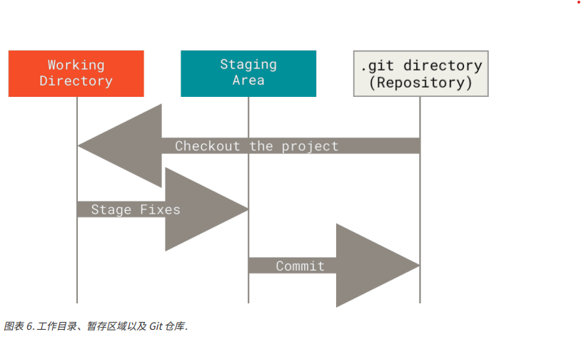

# What is Git?
## Git 工作原理
1. 记录数据差异
    + 每当有文件更新或者项目保持时，git 会为当前此次文件中数据的变化添加一个记录

## Git 工作方式
1. git 文件三种状态
   1. 已修改：表示修改了文件，但是 git 还未记录此次修改
   2. 已暂存：表示已经对一个修改的文件做了记录，还没有保存到本地数据库中
   3. 已提交：数据已经安全的保持到本地的数据库中
2. git 工作三个阶段
    1. 工作区：Git 仓库数据库中提取出来的文件，放在磁盘上用来修改使用的
    2. 暂存区：是一个文件，保存了下次将要提交的列表信息
        + 一般指的是 .git 文件夹下的 index 文件
    3. Git 仓库：用来保存项目的元数据和对象数据库的地方。也是 Git 最主要的部分
3. 图录
   

## Git 工作流程
1. 在工作区中修改文件
2. 将想要下次提交的更改选择性地暂存
3. 提交更新，将修改永久性地存储到 Git 目录中