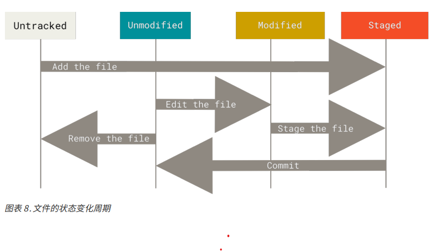

# Recording Changes to the Repository
+ 工作目录下的每个文件只分两种状态，已跟踪和未跟踪
+ 已跟踪指的是那些纳入了版本控制的文件，在上一次的文件变更记录中有他们的记录。
  + 在一段时间后，他们的状态可能是未修改，已修改，和已放入暂存区
  + 简而言之就是 Git 已经知道了该文件的存在
+ 未跟踪的文件指的是没有被Git记录过的文件，既不存在上次修改记录中，也没有放入暂存区

Git 中文件类型

## 检查文件状态
1. `git status`
   1. 检查当前文件状态，能够将文件的状态显示出来
   2. 未跟踪的，已修改的
   3. `git status -s`
      1. 以简洁的方式显示当前仓库中文件的状态

## 跟踪新文件
1. `git add <files>`
   1. 将指定的内容添加到下一次提交中,即提交到暂存区
   2. 能开始跟踪新文件
   3. 将已跟踪的文件夹放到暂存区
   4. 合并时把有冲突的文件标记为已解决

## 忽略文件
1. .gitingore 文件，能够自动的忽略指定的文件
   1. 所有以 # 开头的行都会被忽略
   2. 支持标准的 glob 模式匹配，递归地应用于整个工作区中
   3. 匹配模式可以以 (/) 开头防止递归
   4. 匹配模式可以以 (/) 结尾指定目录
   5. 要忽略指定模式以外的文件或目录，可以在模式前加上叹号 (!) 取反

## 查看已暂存和未暂存的文件
1. `git diff`
   1. 比较工作目录中当前文件和暂存区域记录之间的差异，也就是修改之后还未暂存到本地数据库中的变化内容
2. `git diff --statged`
   1. 将对比已暂存到 git 数据库中文件和最后一次提交的文件差异
3. git diff 本身只显示尚未暂存的改动，而不是上次提交以来所做的所有改动
   1. 所以当暂存了所有更新过的文件之后，运行 git diff 会没有任何对别

## 提交更新
1. `git commit`
   1. 将暂存区的内容提交到 Git 仓库中
2. `git commit -m <submit_message>`
   1. 将提交命令的同时输入提交信息
3. `git commit -a`
   1. 将所有已经跟踪过的文件暂存起来一起提交，提过 `git add ` 步骤
   2. 该选项容易将不需要提交的文件一并提交上去

## 移除文件
1. `git rm `
   1. 从暂存区域移除已跟踪文件，连带从工作目录中删除指定文件
   2. 如果要删除之前修改过的或者已经放到暂存区的文件，需要使用强制删除选项 -f
   3. 从 git 仓库中删除，但是保留在工作目录中，但是没添加到 .gitingore,可以使用 --cached

## 移动文件
1. `git mv <file1> <file2>`
   1. Git 对文件改名
