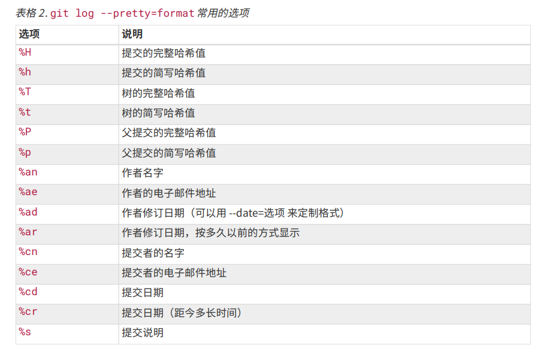
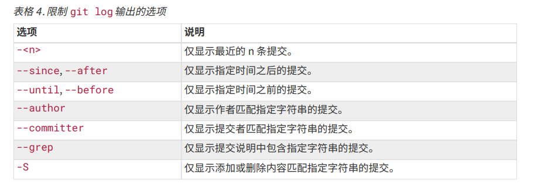

# Git log

## 查看提交记录
1. `git log`
    + 按照时间先后顺序列出所有的提交，最近的更新排在最上面

2. 参数
   1. -p: 按补丁格式显示每个提交引入的差异
   2. - <number>: 显示最近的 number 次提交
   3. --stat: 显示每次提交的文件修改统计信息
   4. --shortstat:只显示 --stat 中最后的行数修改添加移除统计
   5. --name-only:仅在提交信息后显示已修改的文件清单
   6. --name-status:显示新增、修改、删除的文件清单
   7. --abbrev-commit:仅显示 SHA-1 校验和所有 40 个字符中的前几个字符
   8. --relative-date:使用较短的相对时间而不是完整格式显示日期（比如“2 weeks ago”）
   9. --graph:在日志旁以 ASCII 图形显示分支与合并历史
   10. --prerry=oneline/short/full/fuller/format:"%h - %an, %ar : %s"
      1. 每个提交在一行显示
      2. 显示author
      3. 显示 Author/Commit
      4. 显示 Author/AuthorDate/Commit/CommitDate
      5. 定制记录的显示格式
        + 
   11. --oneline: --pretty=oneline --abbrev-commit 合用的简写。

3. 输出选项筛选
   1. --since=2.weeks\"2008-0105"\2 years\1 day: 筛选指定的提交时间
   2. --author: 显示指定的作者提交
   3. -S [function_name]: 搜索指定指定字符串相关变动
      1. 

