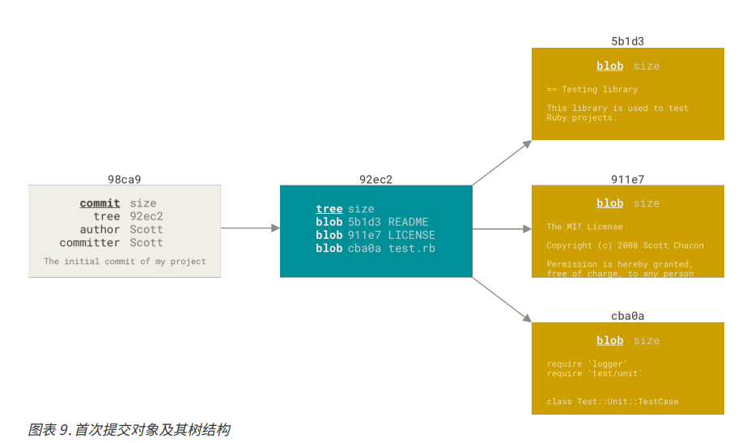
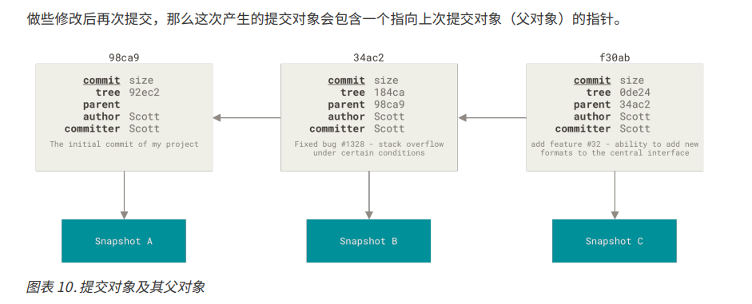

# 分支简介

Git 保存的不是文件的变化和差异，而是一系列的不同时刻的快照

快照的含义是，当前时刻所有文件的内容。这意味着 Git 会保存每个文件的完整副本，而不是只保存与上一版本的变化。

在进行提交操作时，Git 会保持一个提交对象，该提交对象会包含一个指向暂存内容快照的指针，除此之外，还有作者名和邮箱，提交时输入的信息以及指向它父对象的指针。

当然首次提交是没有父对象的，普通提交的操作产生的提交对象是由一个父对象，而有多分支合并而产生的提交有多个父对象

## Git 仓库中每次提交大概会有三类对象
1. blob 对象，保存文件快照
2. 树对象，保存目录结构和 blob 对象索引
3. 提交对象，包含着指向前述树对象的指针和所有提交信息

## Git 提交过程
1. 暂存操作（git add）会为每一个文件计算校验和，然后会把当前版本的文件快照保存到 Git 仓库中，然后将校验和加入到暂存区域等待提交
2. 提交操作（git commit）会先计算每一个子目录的教案和，然后在 Git 仓库中这些校验和保存为树对象。随后 Git 创建一个提交对象，除了包含以上提到的信息外，还包含一个数对象指针。

如此一来 Git 就可以在需要的时候重现此次保存的快照。

## 首次提交对象及其树结构

## 普通提交及其父对象

Git 分支本质是提交对象的可变指针。

## 分支创建
`git branch <branch_name>`
在当前所在的提交对象上创建一个指针

`git log --oneline --decorate`
查看各个分支当前所指的对象

## 分支切换
`git checkout <branch_name>`
HEAD 指针指向 <branch_name> 分支

分支切换会改变工作目录的文件
Git 分支实质上仅是包含所指对象校验和（长度为 40 的 SHA-1 值字符串）的文件，所以它的创建和销毁都异常的高效。创建一个分支相当于往一个文件中写入 41 个字节（40 个字符和 1 个换行符）