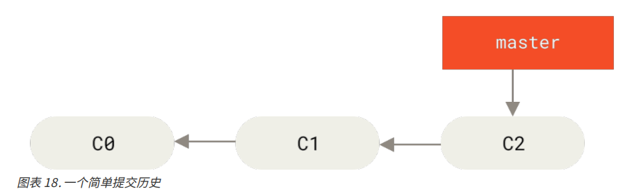
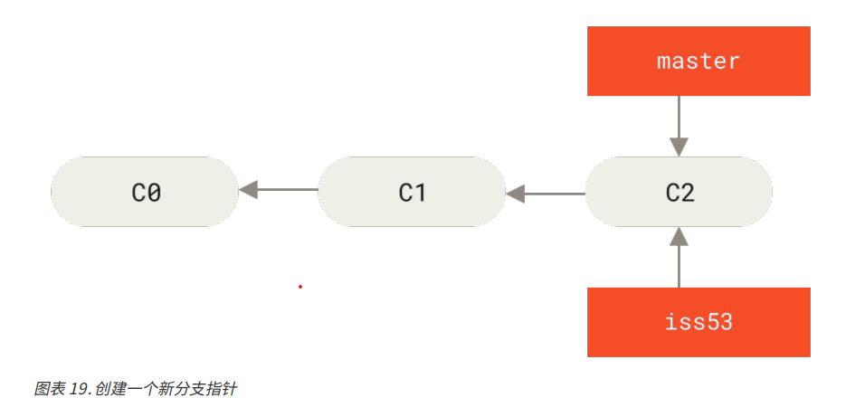
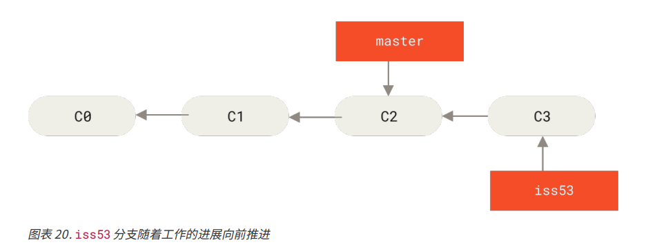
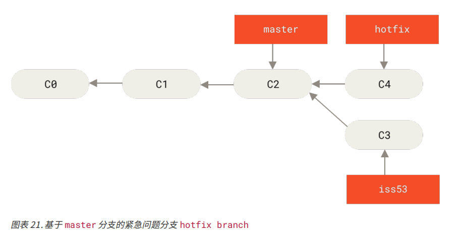
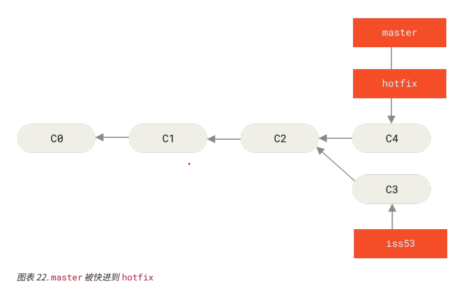
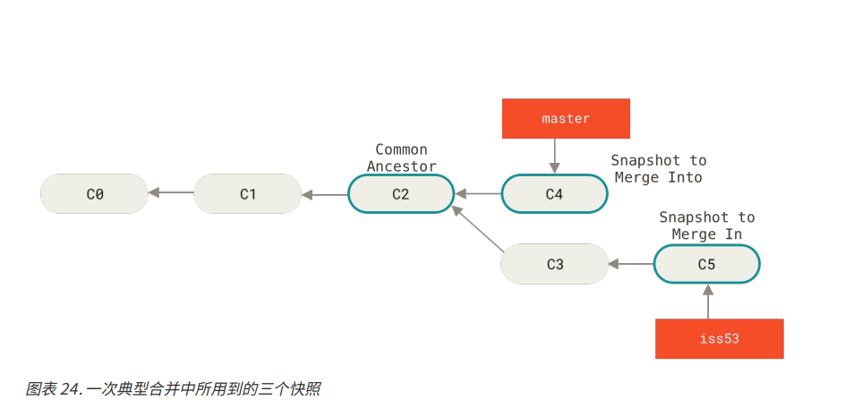
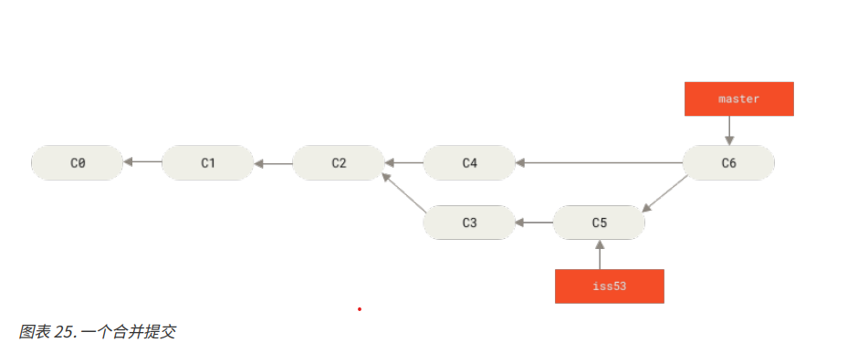

# 分支的新建和合并

一个分支新建和分支合并的简单场景需求：
1. 正在一个分支上开发功能或者解决 BUG
2. 突然接到一个通知需要紧急解决一个 BUG

为了完成这项工作，我们需要按照以下步骤处理：
1. 切换到一个指定的线上分支，这个指定由客户或者 PO ，或者 PM 决定，具体看 BUG 需要在哪个分支上解决
2. 在指定分支上新建一个分支，专门为修改 BUG 使用，该分支成为修补分支
3. 修改代码，然后测试通过
4. 且回到指定的线上分支，然后合并修补分支，最后将改动推送到远端。
5. 切换到最初的工作分支，继续工作

## 新建分支

### 0. 工作环境
假设当前正在 master 分支上工作，且有一些提交，如下图


### 1. 正在进行的工作
   
然后现在要解决公司使用的问题追踪系统中的 #53 问题，为此，新建一个分支并且切换到那个分支上去，假定新建的分支名叫 iss53,那么，切换分支的命令为
`git checkout -b iss53`

上述的命令等同于
```
git branch iss53
git checkout iss53
```



### 2. 工作分支的提交

在 iss53 分支上修改了一些代码，解决了 #53 这个问题，然后做了提交。提交之后分支的流程图如下：


### 3. 接到紧急要求修改 BUG

为了不让当前的工作和需要解决的 BUG 之间工作环境发生冲突，我们可以新开分支专门解决紧急 BUG，姑且称该分支为 hotfix，并且我们得知需要在 master 分支上解决该问题。

1. 保存工作环境
那么我们在新建分支之前，先确保我们当前工作的分支的改动暂存了。我们可以使用 `git commit` 将当前的提交，以保护工作现场。无论当前工作是否已经完成，都可以暂存提交，可以在提交时加上备注描述清楚当前的工作进度。

2. 切回修改分支
在当前工作环境保存好后，我们需要切换到 master 分支
`git checkout master`
此时 HEAD 指针指向 master 本地分支的最新提交

3. 新建修复分支 hotfix

`git checkout -b hotfix`
此时 hotfix 分支和 master，HEAD 一样指向 master 分支的最新一次提交

4. 修复 BUG，并提交

`git add <files>`
`git commit -m "<commit-annotation>"`

提交后，分支图如下：


5. 合并 hotfix 分支

在测试通过之后，需要将 hotfix 分支合并回 master 分支，命令如下：
`git checkout master`
`git merge hotfix`

由于想要合并的分支  hotfix 所指向的提交 C4 是所提交的 C2 的直接后继，所以此次合并 Git 直接将 master 分支指针往前移动。
换句话说，当我们试图合并两个分支时，如果一个分支走下去能够直接到达另一个分支，那么 Git 在合并两者时，只会简单的将后面的指针往前推进即可，这种情况下的合并没有需要解决的分歧的情况，叫做 “fast-forward”，分支图如下所示：



6. 删除 hotfix

当 master 分支合并 hotfix 之后，可以在测试同事测试通过之后，发布出去，然后就可以删除 hotfix 分支了。删除命令如下
`git branch -d hotfix`

### 返回之前的工作分支
解决完解决的 BUG 之后，我们可以继续返回刚开始的工作分支，也就是解决 #53 问题的那个分支
`git checkout iss53`

假设我们已经又提交了一笔，完成了 #53 问题的修复，并且提交之后测试也通过，那么我们接下来要完成合并到 master 的工作

### master 合并 iss53

合并命令如下
```
git checkout master
git merge iss53
```

此次合并和前面 hotfix 合并不太一样，因为此时的分支图中要合并的两个分支有了分叉，即 master 分支所在提交不再是 iss53 的直接祖先了。
这样的情况下， Git 会使用两个分支的末端所指向的快照（C4 C5），以及两个分支的公共祖先（C2），做一个简单的三方合并


和之前将分支指针向前推进的行为不同，Git 会为三方合并的结果做一个新的快照，并且自动创建一个新的提交并指向它。这个过程被叫做合并提交，它的特别之处在于它不止有一个父提交。

合并提交后的分支图


### 删除 iss53
合并之后 iss53 分支就不再需要了，就可以在任务追踪系统中关闭此项任务，并且删除该分支了
`git branch -d iss53`

### 遇到冲突时的合并
在 master 分支合并 iss53 时，过程可能不会如此顺利，如果在这两个不同的分支中，对同一个文件的同一个部分进行了不同的修改，那么 Git 就无法自动合并了，那么 Git 就会向用户报了一个合并冲突，并且等待用户手动解决合并产生的冲突。

在手动解决完冲突后，可以使用提交的步骤重新提交，即
```
git add <file>
git commit -m "<annotation>"
```

提交后，分支的流程图就又回到了下图所示：


