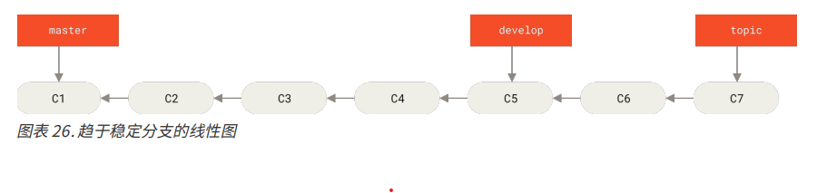
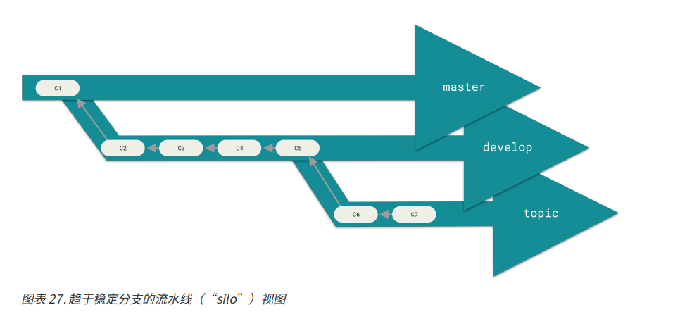
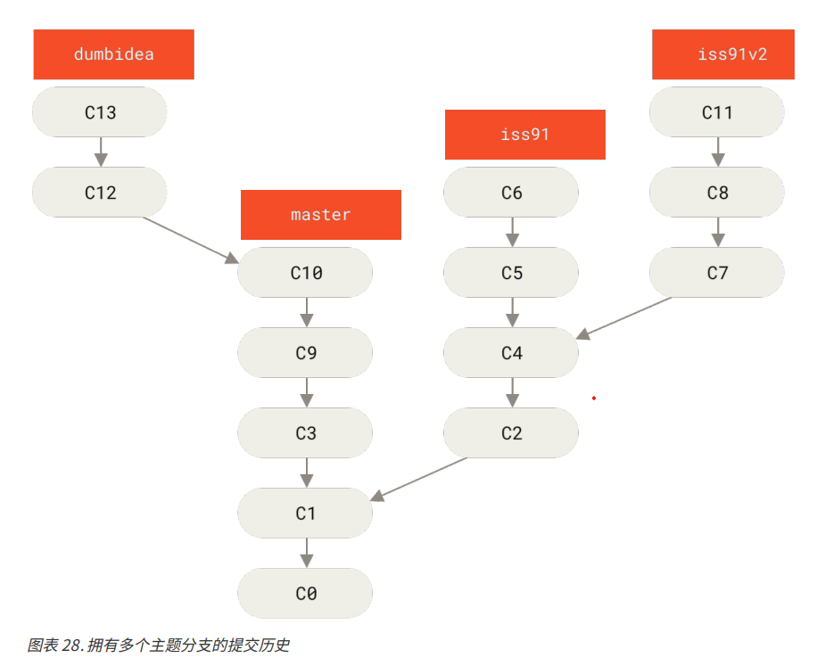
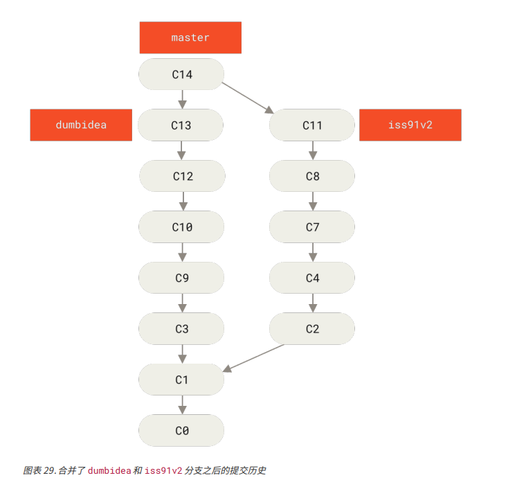

# 分支开发流程

## 长期分支
因为 Git 可以使用简单的三方合并，所以就算再一段很长的时间内反复把一个分支并入到另一个分支中，也不是一件麻烦的事。
所以在整个项目的开发周期的不同阶段，我们可以同时开辟多个开发分支，也可以定期将某些主题分支合并到其他分支中

比如，我们在 **master** 分支中保留完整的代码，仅仅是已经发布的或者即将发布的代码。然后再新建 **develop** 或者 **next** 的平行分支，用来做后续开发或者测试稳定性，这些分支不必保持稳定，但是一旦达到稳定状态，就可以被合并到 **master** 分支中。

上述过程的 Git 分支图如下：

可以将他们想象成流水线(work silos)可能更好理解一些，那些经过测试考验的提交会被遴选到更加稳定的流水线上去

使用以上的分支策略来维护不同层次的稳定性。
一些大型项目还有一个 **proposed update 分支**，他可能包含一些不成熟的内容而不能进入 next 或者 master 分支。
这样做的目的即使为了让本地的开发分支具有不同级别的稳定性；当某些分支具有一定的稳定性之后，再把它们合并到具有更高级别稳定性的分支中。

以上这种划分不同级别稳定性的分支开发策略并非必要选项，但是这种方法通常很有帮助，尤其是当你再一个非常庞大或者复杂的项目中工作时。

## 主题分支

主题分支对于任何规模的项目都适用。主题分支是一个短期分支，被用来实现单一特性或者相关工作。
主题分支的技术能使开发人员快速并且完整的进行上下文切换，因为工作被分割到不同的流水线中，在不同的流水线中每个分支都仅与其目标特性相关，因此在做代码审查之类的工作的时候就能更加容易地看出开发人员做了哪些改动。

考虑以下场景：
1. 我们在 master 分支工作到 C1，
2. 这时候为了解决某个问题新建 iss91 分支，在 iss91 分支上工作到 C4 
3. 此时对该问题又有了新的想法，于是新建 iss91v2 分支试图用另一种方法解决这个问题。
4. 解决完后我们又回到 master 分支工作了一会
5. 此时又冒出一个不太确定的想法，在 C10 的时候新建一个 dumbidea 分支，并在这上面做一些实验

以上的提交历史看起来像下面的样子

接下来，我们假定
1. 决定使用第二个方案作为该问题的解决方案，即使用 iss91v2 分支的提交，抛弃 iss91 分支的提交
2. 然后 dumbidea 分支再经过同事 review 之后，决定也要将该方案合并

于是最终的提交历史如下所示:

需要强调的是，这些分支和提交都属于本地 Git 仓库提交，没有与服务器发生交互。