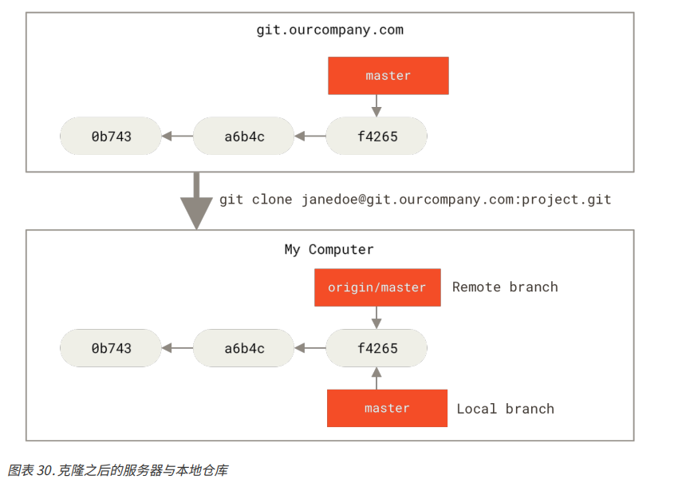
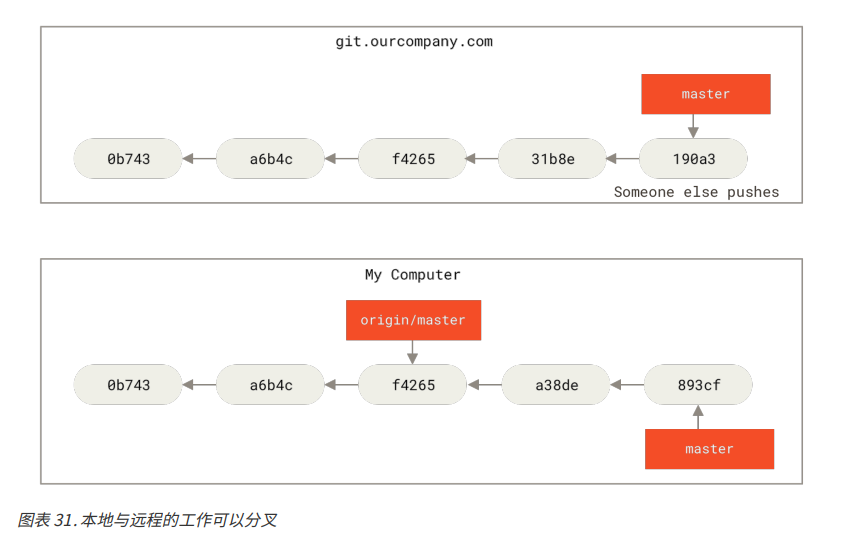
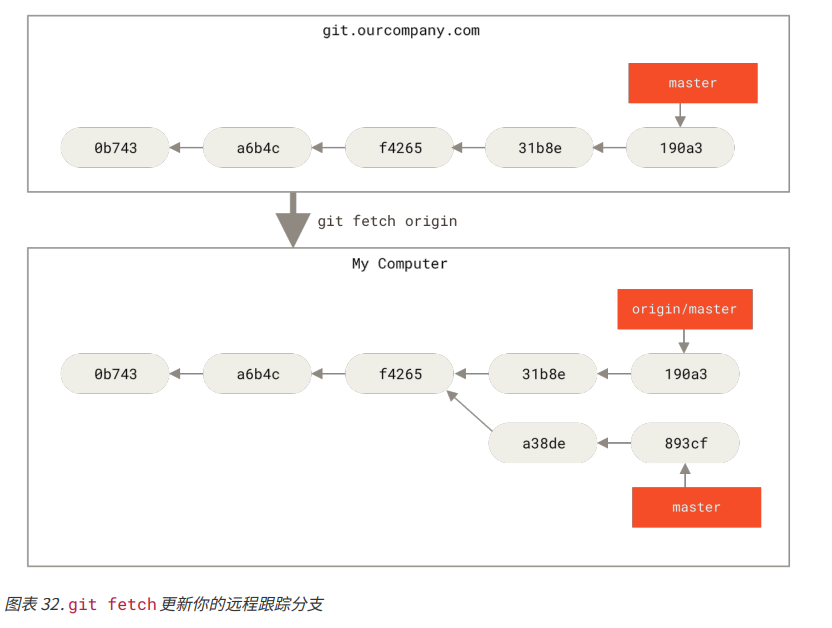
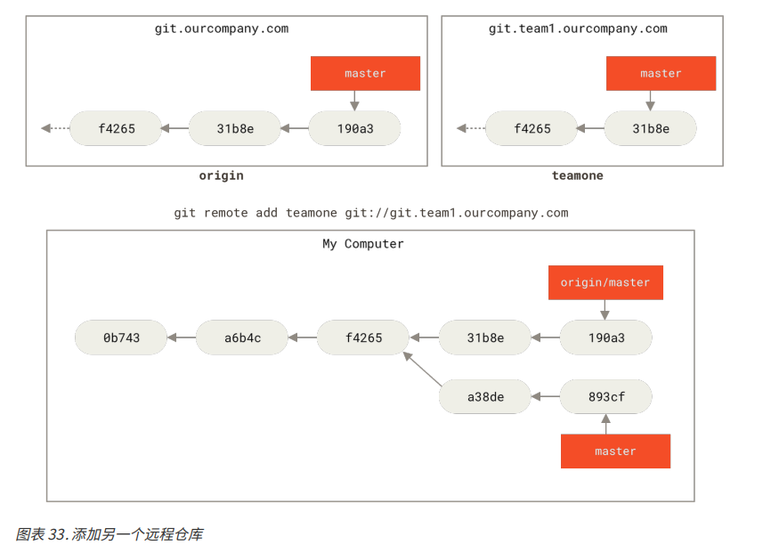
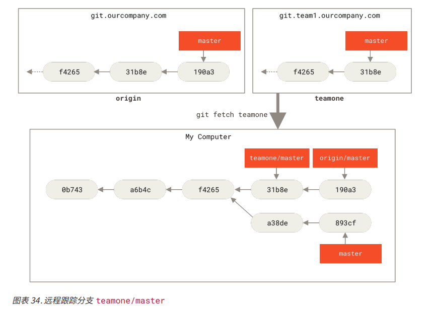

# 远程分支

## 获取远程完整列表
远程引用就是对远程仓库的引用（指针），包括分支，标签等
可以通过命令 `git ls-remote <remote>` 来显式地获得远程引用的完整列表。或者通过命令 `git remote show <remote>` 获取远程分支的更多信息，一般默认的 <remote> 是 origin，也就是说我们可以通过以下命令查看远程分支
```
git ls-remote origin
git remote show origin
```

## 远程跟踪分支
除了显式地获取远程完整列表外，还可以使用远程跟踪分支来获取远程分支
远程跟踪分支就是远程分支状态的状态引用。它们是无法移动的本地引用，一旦本地分支进行了网络通信，Git 会移动该引用以精确的反应远程仓库的状态。
可以将远程跟踪的分支看作是一个标签，这样就可以使用者在该分支在远程仓库中的位置用于最后一次连接到它们的位置

"orign" 是运行 `git clone` 时默认的远程仓库名，如果想要指定的远程分支名，可以如下方命令所示，加上指定的参数
`git clone -o <remote_name>`

远程分支一般以 `<remote>/<branch>` 的形式命令，如果想要看最后一次与远程仓库 origin 通信的 master 分支的状态，那么就可以查看 origin/master 分支。

### 拉取远程分支
假设网络中有一个 git.ourcompany.com 的 Git 服务器，如果我们从这个服务器上克隆一个远程仓库，Git 的 clone 命令自动会为该远程仓库命名为 origin，然后拉去它的所有数据，创建一个指向它的 master 指针，在本地将其命名为 origin/master。并且 Git 还会创建一个本地的 master 分支，指向和 origin/master 指向同一个地方，并且该分支指针就是本地的工作指针。


### 本地开发
开发人员在本地的 master 分支上做了一些工作，在同一时间段内有其他人推送提交到 git.ourcompany.com 并更新了远端的 master 分支。此时就表明本地的仓库分支和远端的仓库分支已经走向不同地方了。当然，此时只要本地不和远端服务器连接拉取数据，那么本地的 origin/master 指针就不会移动，因为本质上，本地仓库和服务器上的仓库已经是两个不同的仓库，只是它们之间有能够互相拉取数据的联系。



### 拉取远程仓库数据
我们可以运行命令 `git fetch <remote>` 命令（本例中使用 `git fetch origin`）。这个命令查找 'origin' 是哪个服务器（本例中是 git.ourcompany.com），从服务器中抓取本地没有的数据，并更新本地数据库，移动 origin/master 指针到更新位置



### 多个远程仓库版本
假定还有另外一个内部 Git 服务器，仅用来某个功能开发团队使用。这个服务器的地址是 git.team1.ourcompany.com

1. 添加该远程仓库引用到本地项目，该远程仓库名命名为 teanone
`git remote add git://git.team1.ourcompany.com`



2. 抓取 teamone 远程仓库数据

`git fetech teamone`



3. 推送
如果想要公开分享一个分支时，需要将其推送到有写入权限的远程仓库上。
本地分支不会自动的与远程仓库同步，如果想要同步到远程，必须显式地推送想要分享的分支。

比如想要和别人一起在一个名为 serverfix 分支上工作，那么就可以像推送第一个分支一样推送它
`git push <remote> <branch>` 即 `git push origin serverfix`

该行命令会将 serverfix 分支名展开为 refs/heads/serverfix:refs/heads/serverfix
意思是，推送本地的 serverfix 分支来更新远程仓库的 serverfix 分支
以上命令也等同于
`git push origin serverfix:serverfix`
通过上述的命令，可以将本地分支推送到一个命名不相同的远程分支上，比如不想让远程分支叫做 serverfix，可以使用该格式
`git push origin serverfix:awesomebranch` 将本地的 serverfix 分支推送到远程仓库上的 awesomebranch 分支上去

上述动作完成后，其他的协作者从服务器抓取数据时，他们的本地就会生成一个远程分支 origin/serverfix 指向服务器的 serverfix 分支的引用

需要注意的是，当抓取到新的远程跟踪分支时，本地是不会自动生成一份可编辑的副本（拷贝）。如果想要编辑指定的远程分支，那么就需要本地新建一个分支关联远程分支。如果一个本地分支有多个远程仓库需要关联，可以使用 `git merge` 到一个本地分支即可，当然前提是关联的多个远程仓库分支是有关系的。

## 跟踪分支
当从一个远程跟踪分支检出一个本地分支会自动创建一个“跟踪分支”，它跟踪的分支叫做“上游分支”。跟踪分支是与远程分支有直接关系的本地分支。

1. 抓取远方分支
如果在一个工作分支上输入 `git pull` Git 能够自动地识别去哪个服务器上抓取、合并到哪个分支。

2. 创建本地分支关联远方分支
当使用克隆命令时，Git 会自动地创建一个跟踪 origin/master 的 master 分支。当然也可以使用以下命令去指定跟踪分支
`git checkout -b <local_branch> <origin>/<branch>`

如果尝试检出的分支不存在，但是有一个能与该名字相同的远程分支，那么 Git 会自动创建一个跟踪分支
`git checkout serverfix`
上述的命令也可以解释为，创建一个本地 serverfix 分支，去关联远程分支 serverfix，但是前提是本地没有 serverfix 分支，且有一个名为 serverfix 的远程分支

3. 设置本地分支关联远方分支
设置一个已有的本地分支跟踪一个刚刚拉取下来的远程分支，或者想要修正正在跟踪的上游分支，可以使用 -u 或者 --set-upstream-to 选项运行 `git branch` 显示地设置
`git branch -u origin/serverfix`

4. 查看设置地所有跟踪分支
`git branch -vv`

需要注意的是，查看的内容都是来自于本地从每个服务器最后一次抓取的数据。该命令并没有来连接服务器，只是本地缓存的服务器数据。
如果想要统计最新的领先与落后数据，可以在运行此命令之前抓取所有的远程仓库
```
git fetch --all
git branch -vv
```

## 拉取

`git fetch` 是从服务器上抓取本地没有的数据，该命令并不会修改工作目录的内容。
`git pull` 本质上是 `git fetch; git merge` 的集合。

## 删除远程分支

`git push origin --delete serverfix`
该命令从服务器上删除 serverfix 分支，本质上是从服务器上移除这个指针
Git 服务器通常会保留数据一段时间直到垃圾回收运行，所以如果是不小心删除，通常是很容易恢复的。
