# 变基

Git 有两种方式来整合不同分支的修改：Merge 和 Rebase

## Merge

再回顾以下 Merge 整合的方式，如下图，开发任务流程到两个不同分支时，又有了各自的提交

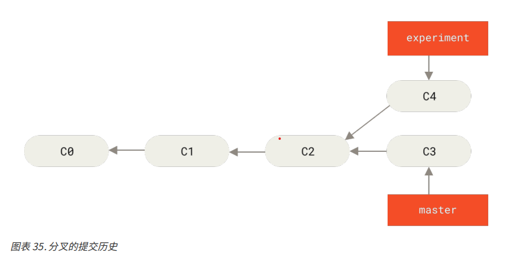

merge 命令会把两个分支的最新快照（C3，C4）以及两者最近的共同祖先（C2）进行三方合并，合并的结果生成一个新的快照（并提交）

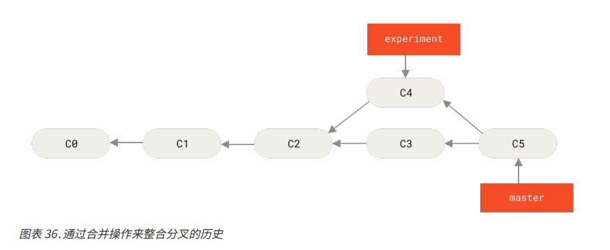

## Rebase

Rebase 的方式是提取 C4 中引入的补丁和修改，然后在 C3 的基础上应用一次。
Rebase 的操作会将提交到某一分支上的所有修改都移到另一个分支上。

比如，我们将上述例子中的 experinment 分支变基到 master 分支上

1. 先检出 experinment 分支，然后再变基到 master 分支上
```
git checkout experinment
git rebase master
```

原理是首先找到这两个分支（当前分支是 experinment，变基操作的目标基底分支 master）的最近共同祖先 C2，然后对比当前分支相对于该祖先的历次提交，提取相应的修改为临时文件，然后将当前分支指向目标基地 C3，最后以此将之前另存为临时文件的修改依序应用。

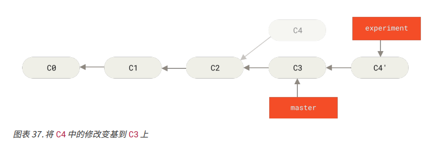

2. 然后切回到 master 分支，进行一次快进合并

```
git checkout master
git merge experinment
```

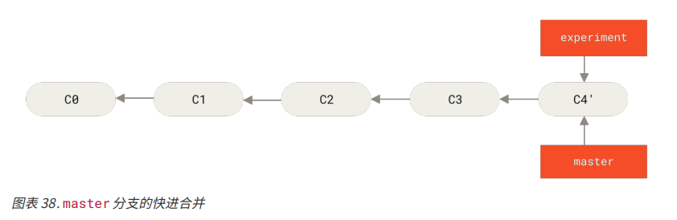

此时 C4' 的快照就和 Merge 命令之后中 C5 的快照一样了。
这两种整合方式最终结果没有任何区别，但是 Rebase 可以使提交历史更加整洁，是一条没有分叉的直线。

Rebase 一般使用的场景是为了确保向远程分支推送时保持提交历史的整洁，比如向某个人维护的项目贡献代码时，在这种情况下我们需要在自己的分支里开发，然后开发完成时需要将本地开发的代码变基到 origin/master 分支上，然后再向主项目提交修改。这样该项目的维护者就不再需要进行整合工作，只需要快进合并即可。

需要强调的是，无论是变基还是三方合并，整合的最终结果所指向的快照始终是一样的，区别在于显示的历史提交不同。
变基是将一系列提交安装原有次序应用到另一分支上，而合并是把最终结果合在一起。

## 更有趣的变基例子

有以下的开发场景：
1. master 是稳定发布的分支，提交了 C1 和 C2 两个提交；
2. 然后此时创建了一个主题分支 server，为服务端添加了一些功能，提交了 C3 和 C4；
3. 在 C3 上创建了主题分支 Client，为客户端添加了一些功能，提交了 C8 和 C9；
4. 然后又回到了 server 分支，提交了 C10

以上的提交最终形成了以下的提交示意图
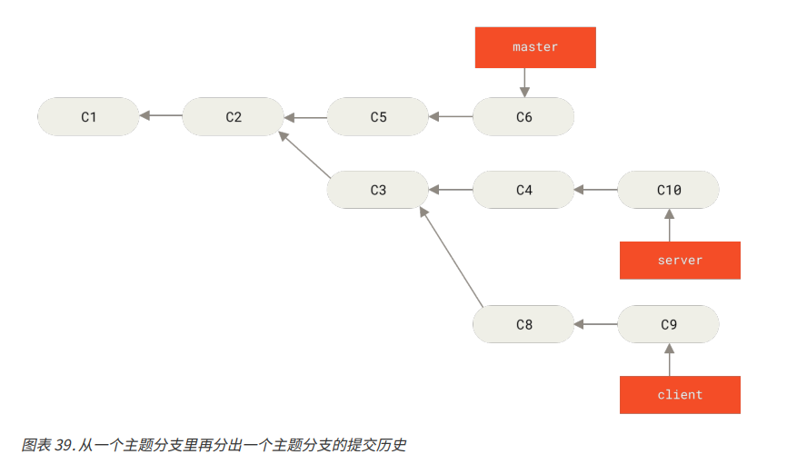

现基于以上的提交历史，有以下需求
1. 想要将 client 分支中的修改合并到主分支并发布，但是暂时不想合并 server 分支，因为他们还需要更全面的测试

解决方案如下：
`git rebase --onto master server client`
以上的命令的含义是：取出 client 分支，找出它从 server 分支分歧之后的补丁，然后把这些补丁在 master 分支上重新测试一遍，让 client 看起来像基于 master 修改一样

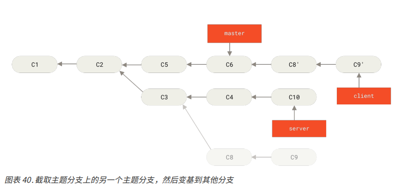

变基之后就可以快进合并 master 分支
```
git checkout master
git merge client
```

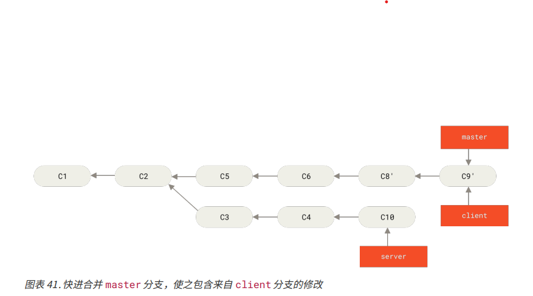

2. 接下来决定将 server 分支中的修改也整合进来
使用命令 `git rebase <base_branch> <topic_branch>` 可以直接将主题分支（server）变基到目标分支（master）上，这样就能省去先切换到 server 分支，再对其执行变基命令的多个步骤了。

`git reabse master server`
将 server 中的修改变基到 master 上，如图所示，server 的代码被 “续” 到了 master 上
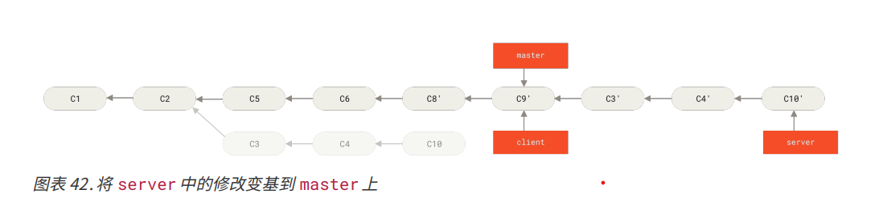

然后就可以快进合并主分支 master 了
```
git checkout master
git merge server
```

至此， client 和 server 分支中的修改都已经合并到主分支力了，也可以删除这两个分支
```
git branch -d client
git branch -d server
```

最终的提交历史会变成下图所示：
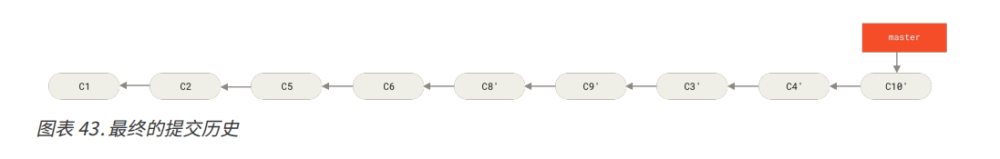

## 变基风险

使用变基需要遵守一条准则：
**最好只在都是自己的提交的分支上使用该命令**

变基操作的是指是丢弃一些现有的操作，然后相应地新建一些内容一样但是实际不同的提交。
如果你已经将一些提交推送至某个仓库，而其他人也已经从该仓库拉取提交并进行了后续工作，此时如果你用 git rebase 命令重新整理了提交并再次推送，其他使用该提交的人需要将他们手头上的工作与你的提交进行整合，然后你也需要拉取并整合他们修改过来的提交。

假设我们从一个中央服务器克隆一个分支并且在它的基础上进行了一些开发，提交历史如下图所示：
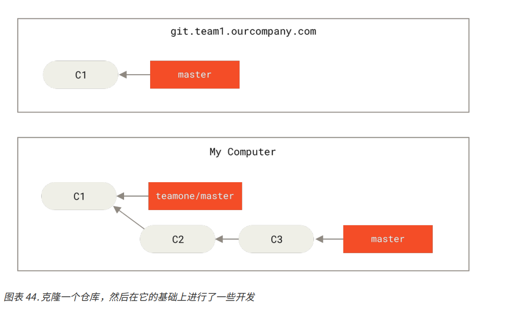

然后有人向服务器上提交了一些修改，包括一次合并。然后我们本地抓取了在远程分支上的修改，并合并到本地的开发分支，然后提交历史记录就会如下所示：

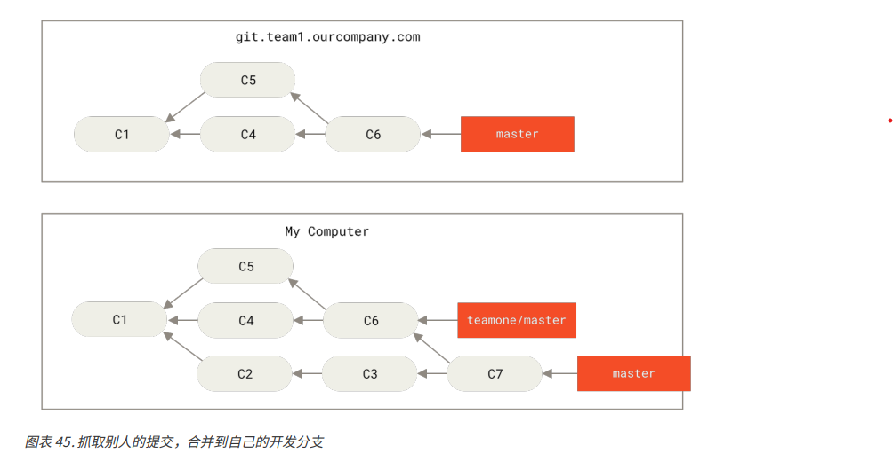

然后上次向服务器提交的人又把合并回退，改用变基，然后又使用 `pit push --force` 覆盖了服务器上的提交历史。
如果我们再从服务器上抓取这些更新，就会多出来一些新的提交
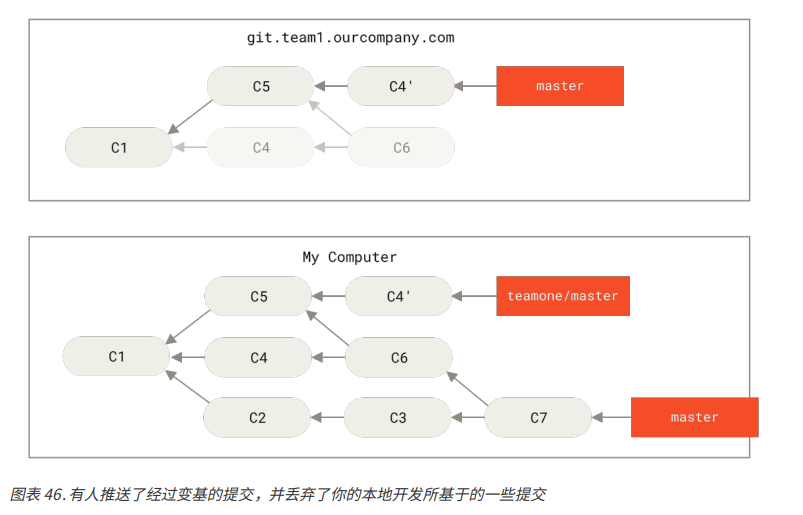

此时，我们双方的处境就非常尴尬，如果我们本地要执行 `git pull`，就会合并来自两条提交历史的内容，生成一个新的合并提交，最终的仓库如下所示：
<span id = "jump">  </span>
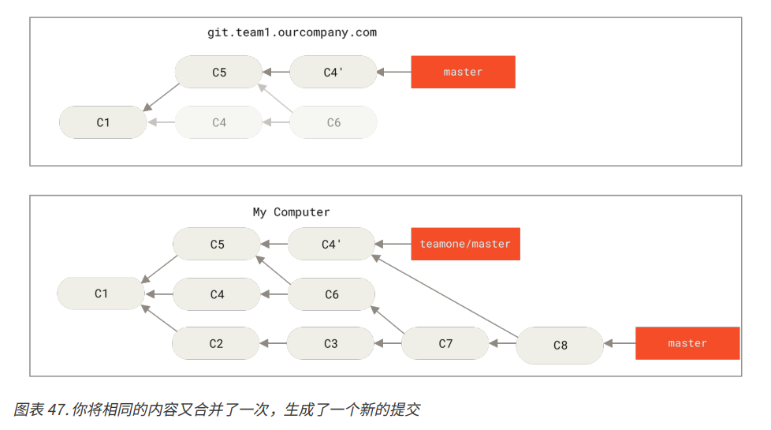

如果此时运行 `git log`，救恩那个发现有两个提交的作者，日期，日志一模一样。
如果将本地的仓库又推送到服务器，那么实际上那些被抛弃的变基又找回来了。

## 用变基解决变基
如果真遇到以上类似的处境，即团队中有人强制推送并覆盖了一些你所基于的提交，你需要检查你做了哪些修改，以及他们覆盖了哪些修改。

实际上 Git 除了对整个提交计算 SHA-1 校验和意外，也会对本次提交所引入的修改计算了校验和，即 “Patch-id”
如果我们拉取被覆盖过的更新，并将手头的工作基于此进行变基的话，一般情况下 Git 能够成功分辨出哪些是本地修改，并将它们应用到新分支上去。

### 方案1：

以上述场景为例，当遇到前面提及的有人推送了经过变基的提交，并丢弃了我们本地开发所基于的一些提交 这种情景，如果我们不执行合并，而是执行 `git rebase teamone/master`, Git 将会
+ 检查哪些提交是本地分支上独有的（C2，C3，C4，C6，C7）
+ 检查其中哪些提交不是合并操作的结果（C2，C3，C4）
+ 检查哪些提交再对方覆盖更新时并没有纳入目标分支（只有 C2 和 C3，因为 C4 就是 C4'）
+ 把查到的这些提交应用到 teamone/master 上面

从而我们得到与 [本地将相同的内容又合并一次，生成了一个新的提交](#jump) 中不同的结果，其结果如下图：
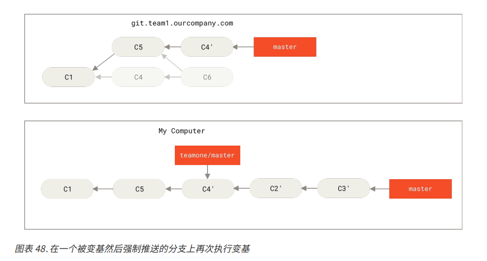

该解决方案有有效的前提下是，其他人在变基时需要保证 C4' 和 C4 是没有手动合并过的，否则变基操作将无法识别，并且会新建一个类似 C4 的补丁，并且该补丁很可能无法干净利落的整合入历史，因为补丁中的修改已经在于某个其他地方了。

### 方案2

可以使用命令 `git pull --rebase` 拉取服务器的远方分支。或者手动完成这个动作
```
git fetch
git rebase teamone/master
```

也可将 --rebase 默认的设置到 `git pull` 命令之中
`git config --global pull.rebase true`

### 总结

如果只对自己本地的分支执行变基，那么就不有事
如果对已经推送过的提交执行变基，而别人没有基于它的提交，那么也不会有事
但是如果对已经推送到公用仓库的提交执行变基命令，并因此丢弃了一些别人的开发所给基于的提交，那么就会有大麻烦
如果基于某种前提，必须要这么做，那么就需要通知每一个再此分支上有提交的人执行 `git pull --rebase` 命令，这样虽然无法彻底避免变基带来的风险，但是至少要安全的多一点

总而言之，只对尚未推送或分享给别人的本地修改执行变基操作轻量历史，而不对已推送到别处的提交执行变基操作。
