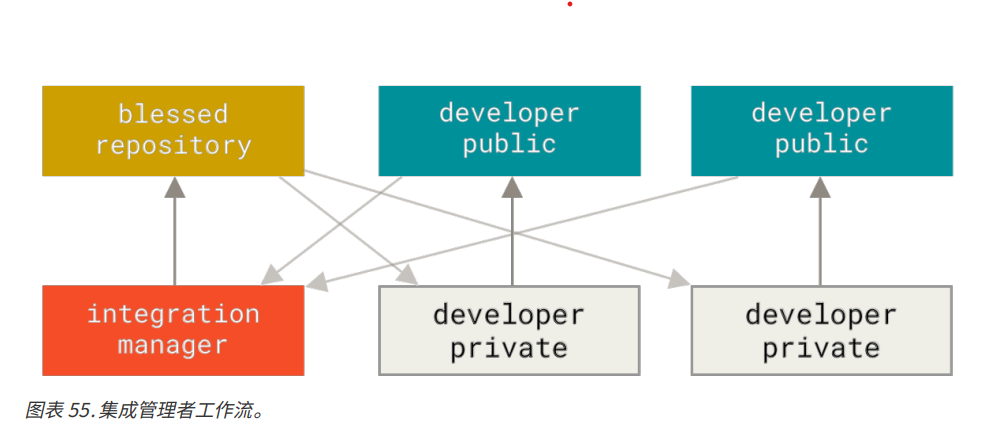
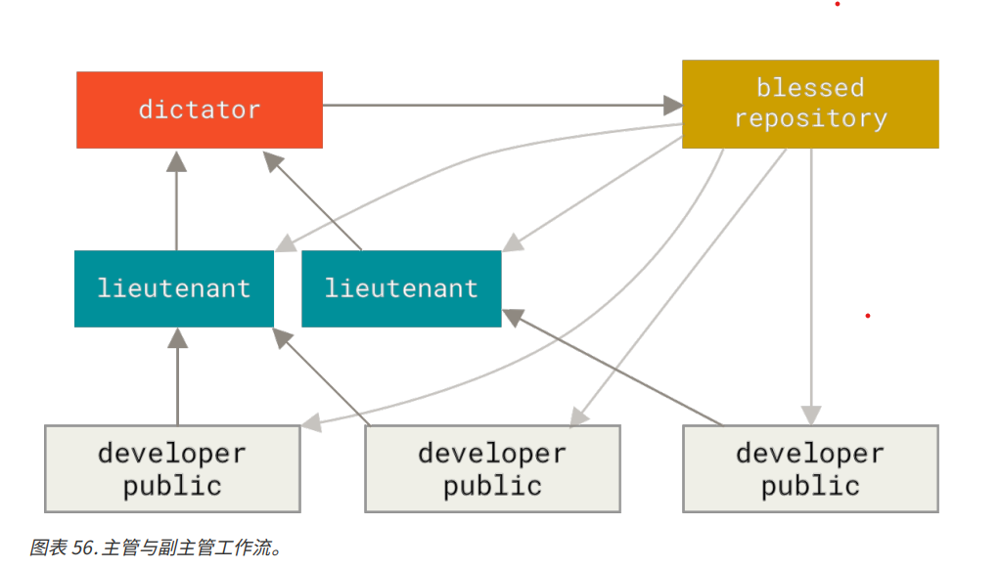

# 分布式工作流

## 集成管理者工作流程
Git 运行多个仓库存在，那么集成管理管理者工作流程就如下：
1. 项目维护者推送到主仓库
2. 贡献者克隆此仓库，作出修改
3. 贡献者将数据推送到自己的公开仓库
4. 贡献者给维护者发送邮件，请求拉取自己的更新
5. 维护者在自己的本地仓库中将贡献者的仓库加为远程仓库并合并修改
6. 维护者将合并后的修改推送到主仓库

## 主管和副主管工作流

该流程是多仓库工作流程的变种，一般的适用环境是数百位协作开发者的超大型项目才会用到这种方式。
副主管是负责各个集成项目中特定部分的集成管理者。
所有的副主管上面还有一个主管的总集成管理者统筹，主管维护的仓库作为参考仓库，为所有协作者提供他们需要拉取的项目代码、
整个流程过程如下所示：
1. 普通开发者在自己的主题分支开发，并根据 master 分支进行变基。参考的是主管管理的 master 分支
2. 副主管将普通开发者的主题分支合并到自己 master 分支中
3. 主管将所有副主管的 master 合并进入自己的 master 分支中
4. 最后，主管将集成后的 master 分支推送到参考仓库，供所有其他开发者以此基础进行变基。

流程图如下所示：

