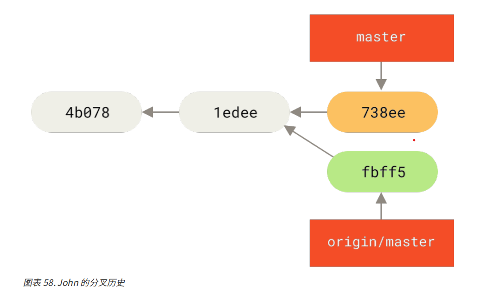
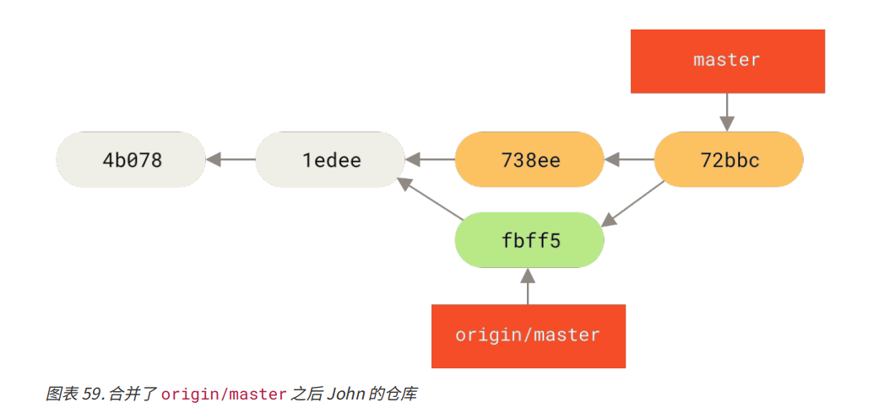
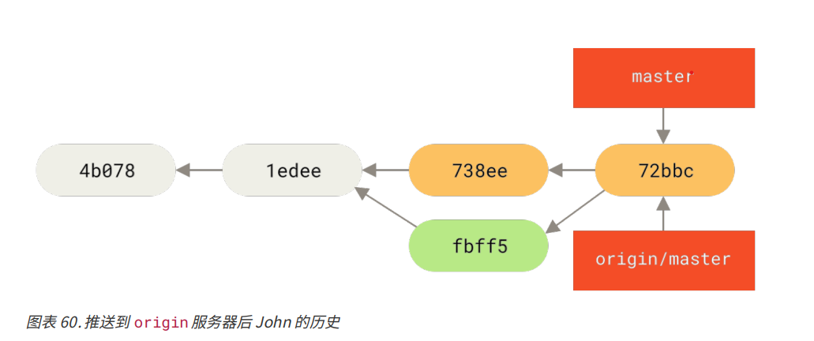
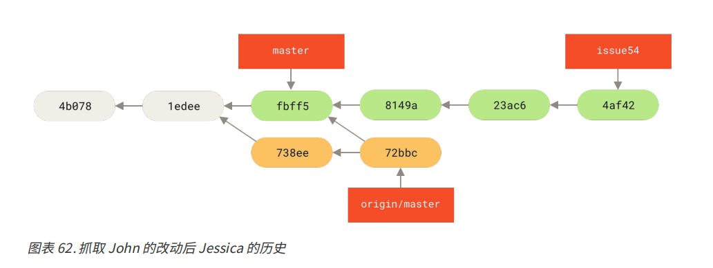
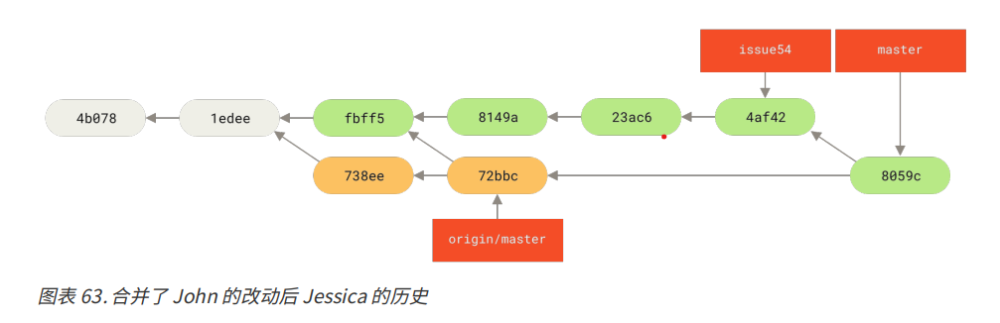
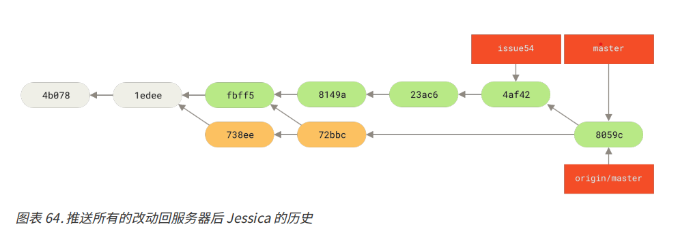
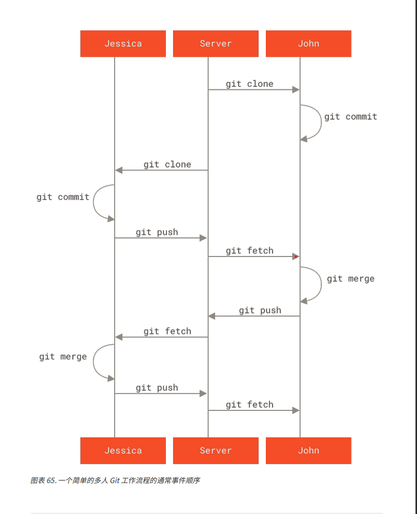

# 向一个项目做贡献

## 提交尊则

1. 提交里不应该包含空白错误。
   1. 可以使用 git diff --check 检查可能的空白错误，并列出来

2. 尝试让每一个提交都成为一个逻辑上可以独立变更集
   1. 如果可以，尝试让改动可以理解。一个问题一个提交，每个提交附带一个有用的信息
   2. 如果其中一些改动修改了同一个文件，使用命令 `git add --patch` 暂存文件

3. 创建一个优质的提交信息
   1. 提交信息应该小于 50 个字符（25个汉字）的单行开始，并且简要地描述变更
   2. 然后接着一个空行，再跟着一个详细地解释
   3. 详细的解释中，包含做改动的动机和它的实现与之前的行为的对比
   4. 使用指令式语气编写提交信息

下面是一个提交信息的模板
```
首字母大写的摘要（不多于 50 个字符）
如果必要的话，加入更详细的解释文字。在大概 72 个字符的时候换行。
在某些情形下，第一行被当作一封电子邮件的标题，剩下的文本作为正文。
分隔摘要与正文的空行是必须的（除非你完全省略正文），
如果你将两者混在一起，那么类似变基等工具无法正常工作。
使用指令式的语气来编写提交信息：使用“Fix bug”而非“Fixed bug”或“Fixes bug”。
此约定与 git merge 和 git revert 命令生成提交说明相同。
空行接着更进一步的段落。
- 标号也是可以的。
- 项目符号可以使用典型的连字符或星号，后跟一个空格，行之间用空行隔开，
  但是可以依据不同的惯例有所不同。
- 使用悬挂式缩进
```

### 私有小型化团队
该场景是有一两个其他开发者的私有项目。“私有”在这个上下文中，意味着闭源，不可以从外界中访问到，相关的开发者都有仓库的推送权限

来看以下场景：
1. John 克隆了一个仓库，做了改动，本地提交
2. Jessica 做了同样的事情，克隆仓库改动并提交
3. Jessica 将提交推送到服务器上，一切正常
4. John 推送到服务器，但是推送失败。

这时，John 如果想要推送，应该先抓取服务器的代码
`git fetch origin`

然后 John 的而本地仓库就像下图所示：


然后合并
`git merge origin/master`
合并后的提交记录如下：


合并后，John 需要测试自己的工作没有受到 Jessica 工作的影响，测试通过后，就可以将合并后的工作推送到服务器上。
最终，John 的本地仓库提交分支如下图所示：


5. 在此期间，Jessica 新建了一个 issue54 的主题分支，并在该分支上提交三次，她并没有抓取 John 的改动，那么她的本地提交历史如下图：


6. Jessica 发现 John 向服务器推送一些新工作后，她抓取了所有服务器上的新内容 
`git fetch origin`

于是，Jessica 的本地提交记录如下：


7. Jessica 认为他的主题分支工作已经完成，想要推送自己本地分支提交
推送之前，她需要知道将 John  工作的哪些分支合并到自己的工作中才能推送
`git log --no-merges issue54..origin/master`
issue54..origin/master 是一个日志过滤器，要求 Git 只显示所有在后面的分支（origin/master）但是不在前面分支（本例中是 issue54）的提交列表

如上图所示，只有 738ee 这个提交符合上述的要求。

然后，Jessica 可以合并他的特性工作到她的 master 分支，合并 John 的工作（origin/master）进入她的 master 分支，然后再次推送回服务器。
8. 首先，从已经提交了所欲 issue54 的主题分支上且回到 master 分支
`git checkout master`

9. 合并分支 issue54 和远程分支 origin/master
`git merge issue54`

这将是一个简单的快速合并.

`git merge origin/master`

合并之后的结果如下：


10. 此时 Jessica 就可以将本地的分支推送到服务器上去了
`git push origin master`

至此，每个开发者都完成了本地开发并成功合并了其他人的工作，最终的 Jessica 提交历史记录如下


这是一个简单的工作流程。通常开发者会在一个主题分支上工作一会，当它准备好整合时就合并到本地的 master 分支。当想要共享工作时，如果有改动的话就抓取它然后合并到你自己的 master 分支，之后推送到服务器上的 master 分支。
上述的顺序通常如下所示：

