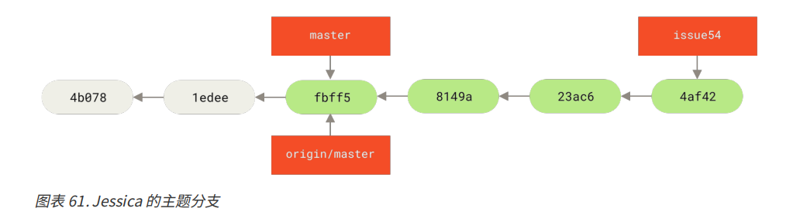

# 向一个项目做贡献

## 提交准则

1. 提交里不应该包含空白错误。
   1. 可以使用 git diff --check 检查可能的空白错误，并列出来

2. 尝试让每一个提交都成为一个逻辑上可以独立变更集
   1. 如果可以，尝试让改动可以理解。一个问题一个提交，每个提交附带一个有用的信息
   2. 如果其中一些改动修改了同一个文件，使用命令 `git add --patch` 暂存文件

3. 创建一个优质的提交信息
   1. 提交信息应该小于 50 个字符（25个汉字）的单行开始，并且简要地描述变更
   2. 然后接着一个空行，再跟着一个详细地解释
   3. 详细的解释中，包含做改动的动机和它的实现与之前的行为的对比
   4. 使用指令式语气编写提交信息

下面是一个提交信息的模板
```
首字母大写的摘要（不多于 50 个字符）
如果必要的话，加入更详细的解释文字。在大概 72 个字符的时候换行。
在某些情形下，第一行被当作一封电子邮件的标题，剩下的文本作为正文。
分隔摘要与正文的空行是必须的（除非你完全省略正文），
如果你将两者混在一起，那么类似变基等工具无法正常工作。
使用指令式的语气来编写提交信息：使用“Fix bug”而非“Fixed bug”或“Fixes bug”。
此约定与 git merge 和 git revert 命令生成提交说明相同。
空行接着更进一步的段落。
- 标号也是可以的。
- 项目符号可以使用典型的连字符或星号，后跟一个空格，行之间用空行隔开，
  但是可以依据不同的惯例有所不同。
- 使用悬挂式缩进
```

## 私有小型化团队
该场景是有一两个其他开发者的私有项目。“私有”在这个上下文中，意味着闭源，不可以从外界中访问到，相关的开发者都有仓库的推送权限

来看以下场景：
1. John 克隆了一个仓库，做了改动，本地提交
2. Jessica 做了同样的事情，克隆仓库改动并提交
3. Jessica 将提交推送到服务器上，一切正常
4. John 推送到服务器，但是推送失败。

这时，John 如果想要推送，应该先抓取服务器的代码
`git fetch origin`

然后 John 的而本地仓库就像下图所示：


然后合并
`git merge origin/master`
合并后的提交记录如下：


合并后，John 需要测试自己的工作没有受到 Jessica 工作的影响，测试通过后，就可以将合并后的工作推送到服务器上。
最终，John 的本地仓库提交分支如下图所示：


5. 在此期间，Jessica 新建了一个 issue54 的主题分支，并在该分支上提交三次，她并没有抓取 John 的改动，那么她的本地提交历史如下图：



6. Jessica 发现 John 向服务器推送一些新工作后，她抓取了所有服务器上的新内容 
`git fetch origin`

于是，Jessica 的本地提交记录如下：


7. Jessica 认为他的主题分支工作已经完成，想要推送自己本地分支提交
推送之前，她需要知道将 John  工作的哪些分支合并到自己的工作中才能推送
`git log --no-merges issue54..origin/master`
issue54..origin/master 是一个日志过滤器，要求 Git 只显示所有在后面的分支（origin/master）但是不在前面分支（本例中是 issue54）的提交列表

如上图所示，只有 738ee 这个提交符合上述的要求。

然后，Jessica 可以合并他的特性工作到她的 master 分支，合并 John 的工作（origin/master）进入她的 master 分支，然后再次推送回服务器。
8. 首先，从已经提交了所欲 issue54 的主题分支上且回到 master 分支
`git checkout master`

9. 合并分支 issue54 和远程分支 origin/master
`git merge issue54`

这将是一个简单的快速合并.

`git merge origin/master`

合并之后的结果如下：


10. 此时 Jessica 就可以将本地的分支推送到服务器上去了
`git push origin master`

至此，每个开发者都完成了本地开发并成功合并了其他人的工作，最终的 Jessica 提交历史记录如下


这是一个简单的工作流程。通常开发者会在一个主题分支上工作一会，当它准备好整合时就合并到本地的 master 分支。当想要共享工作时，如果有改动的话就抓取它然后合并到你自己的 master 分支，之后推送到服务器上的 master 分支。
上述的顺序通常如下所示：


## 私有管理团队
接下来介绍大型私有团队贡献者的角色，基于小组特性进行协作

假设 John 和 Jessica 在一个特性中（featureA）上工作，同时 Jessica 与第三个开发者 Josie 在第二个特性（featureB）上工作。
本例中，公司使用了一种整合-管理者工作流程，独立小组的工作只能被特定的工程师整合，主仓库的 master 分支只能被那些工程师更新。在这种情况下，所有的工作都是基于团队的分支上完成的并且稍后会被整合者拉到一起。

因为 Jessica 在两个特性上工作，并且平行地与两个不同的开发者写作，那么就以她的视角开始跟随整个代码提交的流程。

首先，假设 John 已经克隆了仓库，并且决定在 featureA 上工作
1. 先创建一个 featureA 工作分支
```
# Jessica's Machine
git checkout -b featureA
```

2. 修改文件，提交，推送
`git push -u origin featureA`

3. 通知其他成员
Jessica 邮件通知 John 她推送到 featureA 的工作

4. 新建一个 featureB 工作分支

在等待 John 的反馈之前，再开一个分支完成 featureB 的工作。
```
# Jessica's Machine
git fetch origin
git checkout -b featureB origin/master
```

5. 在 featureB 上创建几次提交
创建几次提交后，Jessica 的本地仓库提交记录如下：


6. 远程新增 featureBee 分支

在准备推送 featureB 的工作之前，收到了 Josie 的邮件通知，远程服务器上已经专门为 featureB 开了一个远程分支 featureBee。此时 Jessica 在推送本地提交之前，需要将远程的改动与本地合并

```
git fetch origin
git merge origin/featureBee
```

合并且解决了可能存在的冲突之后，Jessica 想要将本地的工作推送到 featureBee 中，而不是之前的 master 分支
`git push -u origin featureB:featureBee`

推送成功

7. 验证 featureA 分支

此时，John 的反馈也过来了。他已经推动一些改动到 featureA 分支上，要求她验证，于是拉取，合并工作将要展开
```
git fetch origin
git log featureA..origin/featureA
```
Jessica 抓取了最新的 featureA 分支，并且查看了 John 新的工作日志

如果 Jessica 觉得没有问题的话，那么就可以将 John 的新工作合并到本地的 featureA 分支上
```
git checkout featureA
git merge origin/master
```

8. feature 修改，提交

Jessica 如果想要对整个合并之后的内容做一些小修改，于是她将这些修改提交到本地的 featureA 分支，然后推送到服务器

推送之后，Jessica 的本地提交记录如下图所示：


9. 最终图示

Jessica、Josie、John 通知整合者服务器上的 featureA 和 featureB 分支准备好整合到主线中了。整合者将这些分支合并到主线上后，就能一次将这些新的合并提交并抓取下来，整个历史提交如下：


上述的工作流程顺序图如下：


## 派生的公开项目

向公开项目做贡献有一点不一样。因为没有权限直接更新项目的分支，贡献者必须使用其他方式通知维护者
1. 克隆项目，为计划贡献的补丁或补丁序列创建一个主题分支
```
git clone <url>
cd project
git checkout -b featureA
...work...
git commit
...work...
git commit
```

我们可以使用 rebase -i 将多个提交压缩成一个提交，或者重排提交中的工作使补丁更容易被维护者审核

2. 创建可写的派生仓库
放分支工作完成后准备将其贡献回维护者，去原始项目中点击 Fork 按钮，创建一份自己可写的项目派生仓库。
`git remote add myfork <url>`

3. 推送
将需要推送的工作推送到自己的仓库中
`git push -u <my_fork> featureA`

4. 通知原项目的维护者
当对应的提交推送到自己的派生仓库中后，需要通知原项目的维护者你有他们想要合并的工作，这个动作通常被称为拉取请求。
一般可以通过网站生成它，Github 有它自己的 Pull Request 机制，也可以运行 `git request-pull` 命令将随后的输出通过电子邮件的方式手动发送给项目维护者

`git request-pull` 命令接受一个要拉取主题分支的基础分支，以及他们要拉取的 Git 的仓库，产生一个请求拉取的所有修改的摘要。

例如 Jessica 想要发送 John 一个拉取请求，她刚刚在推送的分支上做两次提交，她可以运行下面的命令：
`git reuqest-pull origin/master <my_fork>`

这个输出可发送给维护者，它告诉他们工作是从哪个分支开始的，提交的摘要，已经从哪里拉取这些工作。

在一个你不是维护者的项目上，通常有一个总是跟踪 origin/master 的 master 分支会很方便，在主题分支上做工作是因为如果他们被拒绝时可以很轻松的丢弃掉这些工作。
如果同一时间主仓库移动了然后我们的本地提交不能干净的合并进去，那么使工作主题分支独立于主题分支也能够让变基这一动作共容易。

假如：我们想要提供第二个特性工作到项目上，不想要继续在刚刚推送的主题分支上工作，那么从主仓库的 master 分支重新开始
```
git checkout -b featureB origin/master
...work...
git commit
git push my_fork featureB
git request-pull origin/master my_fork
... email generated request pull to maintainer ...
git fetch origin
```

现在每个特性都保存在贮藏库中，类似于补丁队列，可以重写、变基与修改，而不会让特性互相干涉或者互相依赖，例如以下：


假如项目维护者拉取了一串其他补丁，然后尝试拉取我们的第一个分支，到那时没有干净的合并。在这种情况下，可以尝试变基那个分支到 origin/master 的顶部，为维护者解决冲突，但是重新提交你的改动：
```
git checkout featureA
git rebase origin/master
git push -f <my_fork> featureA
```

这样会重写我们的本地提交历史，下面是 featureA 工作之后的提交历史：


因为分支变基了，所以必须为推送命令指定 -f 选项，这样才能将服务器上有一个不是它的后代的提交 featureA 分支替换掉。一个替代的选项是推送这个新工作到服务器上的一个不同分支（可能称作 featureAv2）

下面是一个更有可能的情况：
维护者看到了你的第二个分支上的工作并且很喜欢其中的概念，但是想要你修改一下实现的步骤。你也可以利用这次机会将工作基于项目现在的 master 分支。
现在从 origin/master 分支开始一个新的分支，在那里压缩 featureB 的改动，解决任何冲突，改变实现，然后推送它为一个新分支。
```
git checkout -b featureBv2 origin/master
git merge --squash featureB
... change implementation ...
git commit
git push myfork featureBv2
```

--squash 选项接受并合并的分支上的所有工作，这将压缩至一个变更集，使仓库变成一个真正的合并并发生的状态，而不会真的生成一个合并提交。这意味着你未来的提交将会只有一个父提交，并允许你引入另一个分支的所有更改，然后再记录一个新提交前做更多的改动。同样 --no--commit 选项再默认合并过程中可以用来延迟生成合并提交。

现在可以给维护者发送一条信息，表示我们已经做了要求的修改，然后他们可以在我们的本地 featureBv2 分支上找到那些改动


## 通过邮件的公开项目

许多项目建立了接受补丁的流程，需要检查每一个项目的特定规则，因为每个项目都不一样。下面演示一个示例：

工作流程与之前的用力是类似的，你为工作的每一个补丁序列创建主题分支，区别是如何提交它们到项目中，生成每一个提交序列的电子邮件版本然后发送到开发者邮件列表，而不是派生项目然后推送到我们自己本地
```
git checkout -b topicA
... work ...
git commit 
... work ...
git commit
```

现在有两个提交需要发送到邮件列表。使用 `git format-patch` 来生成可以邮寄到列表的 mbox 格式的文件，它可以将每一个提交转换成一封电子邮件，提交信息的第一行作为主题，剩余信息与提交引入的补丁作为正文。
它有一个好处是使用 foramt-patch 生成的一封电子邮件应用的提交正确地保留了所有提交信息。

`git format-patch -M origin/master`
format-pathc 命令打印处它创建地补丁文件名称。-M 开关告诉 Git 查找重命名。
也可以编辑这些补丁文件为邮件列表添加更多不想要在提交信息中显示出来的信息。如果在 --- 行与补丁开头（diff --git 行）之间添加文本，那么开发者就可以阅读它，但是应用补丁会忽略它。

Git 提供一个工具帮助用户通过 IMAP 发送正确格式化的补丁。
1. 设置 imap 区块

在 ~/.gitconfig 文件中设置 imap 区块。可以通过一些列的 git config 命令来设置每一个值，或者手动添加它们，最后的文件格式如下
```
[imap]
  folder = "[Gmail]/Drafts"
  host = imaps://imap.gmail.com
  user = user@gmail.com
  pass = YX]8g76G_2^sFbd
  port = 993
  sslverify = false
```
如果 IMAP 服务器不使用 SSL，最后两行可以不添加。host 的值会是 imap:// 而不是 imaps://

2. 放置文件至指定文件夹
   
使用 `git imap-send` 将补丁序列放到特定 IMAP 服务器的 Drafts 文件夹中
```
cat *.patch | git imap-send
```

3. 配置邮件服务器选项

使用 git config 命令设置邮件服务器选项，或者手动添加到 sendmail 模块
```
[sendemail]
  smtpencryption = tls
  smtpserver = smtp.gmail.com
  smtpuser = user@gmail.com
  smtpserverport = 587
```

4. 发送

`git send-email *.patch`

