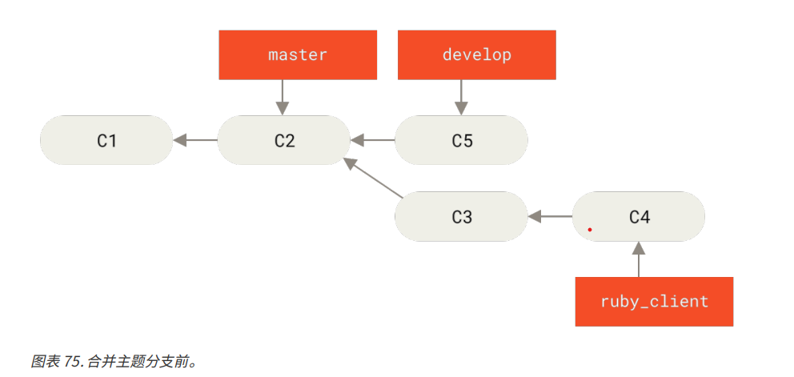

# 维护项目

除了有效地参与一个项目的贡献之外，我们还需要了解一下如何维护项目。
这包含接受并应用他人使用的 format-patch 生成并通过电子邮件发送过来的补丁，或对项目添加的远程版本库分支中的更改进行整合。
但无论是管理版本库，还是帮忙验证、审核收到的补丁，都需要同其他贡献者约定某种长期可持续的的工作方式。

## 在主题分支中工作

如果想要在向项目中整合一些新东西，最好将这些尝试局限在**主题分支**中，一种通常用来尝试新东西的临时分支。
这样便于单独补充补丁，如果遇到无法正常工作的情况，可以先不用管，等有时间的时候再来处理。

如果基于所尝试的工作的特性为分支建立一个简单的名字，如 ruby_client 或者具有类似描述的其他名字，这样即使后面再回头时，也不会忘记建立该分支的目的
项目维护者一般还会为这些分支附带命名空间，如 sc/ruby_client（其中 sc 是贡献该项目的人的名字的缩写）
使用以下方式基于 master 分支建立主题分支
`git branch sc/ruby_client master`

如果同时想要立刻切换到新分支上去的话，可以使用 checkout -b
`git checkout -b sc/rub_client master`

现在我们已经准备好将其他人的贡献加入到这个主题分支上，并考虑是否将其合并到长期分支中去。

### 来自邮件的补丁

如果我们收到一份需要整合进入项目的电子邮件，首先需要将其应用到主题分支上去进行评估。有两种应用该种补丁的方法：git apply，git am

#### git apply
如果收到一封使用 git diff 或者 Unix diff 命令的变体（不推荐使用）创建的补丁，可以使用 git apply 命令来应用。
假设将补丁保存在了 /tmp/patch-ruby-client.patch 中，可以这样应用补丁
`git apply /tmp/patch-ruby-client.patch`

这会修改工作目录的文件
它与允许 patch -p1 命令来应用补丁几乎是等效的，但是这种方法更加严格，相对于 patch 来说，它能接受的的模糊匹配更少
它能处理 git diff 格式文件所描述的文件添加，删除和重命名操作，而 patch 不会
最后，git apply 命令采用了一种“全部应用，否则就全部撤销”的模型，即补丁只有全部内容被应用，和完全不被应用两种状态，而 patch 可能会导致补丁文件被部分应用，最后使本地的工作目录处于一个半修改的奇怪状态中

总体来看，git apply 命令要比 patch 谨慎的多，并且它不会为你创建提交，在允许之后，需要手动暂存并提交补丁所引入的更改。
在实际应用补丁之前，可以先检查一下补丁是否能顺利应用
`git apply --check <patch_name>`
如果没有输出，那么补丁就可以顺利应用，如果检查失败，该命令会以一个非零的状态推出，所以需要时可以在脚本使用它

#### git am
如果想要应用一个 format-patch 补丁，更应该使用 git am 命令，am 的命令的含义就是 apply 一系列来自邮箱的 Mailbox 的补丁，所以从技术角度上来说，git am 就是单纯的为了读取 mbox 文件而构建的，mbox 是一种用来在单个文本文件中存储一个或多个电子邮件消息的简单纯文本格式。

贡献者将 git format-patch 生成的补丁上传到工单系统或者类似的任务处理系统。然后维护者先保存到本地，然后使用 git am 来应用补丁
`git am <patch_name>`

命令执行过后，如果顺利被应用，可以自动地创建一个新的提价。作者信息来于电子邮件头部的 From 和 Date 字段，提交信息则取自 Subject 和 邮件正文中补丁之前的内容

如果无法顺利被应用，命令会在所有出现问题的文件内加入冲突标记，然后剩下的步骤就和发生冲突的合并或者变基操作一样，解决这些问题的手段大多程度上是一样的，即使用手动编辑这些问题来解决这些冲突，暂存新的文件，之后允许 git am --resolved 继续应用下一个补丁

`git am -3 <patch_name>`
尝试三方合并，该选项默认没有打开，如果用于创建补丁的提交并不在本地版本库内的话，选项不生效

如果正在利用一个 mbox 文件应用多个补丁，也可以在交互模式下允许 am 命令，这样在每个补丁之前，它会不停的询问你是否应用该补丁。这样的询问会在补丁较多时很好用，因为可以在应用之前查看忘掉内容的补丁，并且跳过已经应用的补丁

当与特性相关的所有补丁都被应用并提交到分支中之后，就可以选择是否已经如何将其整合到更长期的分支中去了。

### 检出远程分支

如果一个我们作为维护者的分支被一个贡献者建立了自己的版本库，并且向其中推送了若干修改，之后将版本库的 URL 和包含更改的远程分支发送给了我们，那么我们可以将其添加为一个远程分支，并在本地进行合并。

比如 Jessica 发邮件说，在她的版本库 ruby_client 分支中有一个很不错的功能。我们为测试该功能，将其添加为一个远程分支，并在本地检出
```
git remote add jessica git://github.com/jessica/myproject.git
git fetech jessica
git checkout -b rubyclient jessica/ruby_client
```

如果她又发了一个有i按，说另一个分支也包含了一个很优秀的功能，因为之前已经设置好远程分支了，可以直接 fetch 和 checkout 操作

这样的模式对于提交补丁频率较小的贡献者来说比较友好。相对于每个人维护自己的服务器，不断增删远程分支的做法，使用电子邮件来说比较省时，而且也不用加入数百个只提供一两个补丁的远程分支。
此外，这种方法还可以同时得到提交历史，虽然代码合并中可能会出现问题，但是也能获取他人的工作是基于我们历史中具体哪一个位置；
Git 会默认进行三方合并，不需要提供 -3 选项，也无需担心补丁是基于某个无法访问的提交生成的

对于这种非持续性的合作，如果依然想要以此种方式拉取数据的话，可以对远程版本库的 URL 调用 git pull 命令，这会执行一个一次性的抓取，而不会将该 URL 存为远程引用
`git pull https://github.com/onetimeguy/project`

### 确定引入了哪些东西

如果我们有一个包含了其他人贡献的主题分支，现在我们可以决定如何处理它们。本节回顾了若干命令，以便于我们检查若干合并入主分支所引入的更改。

一般来说，应该对该分支中所有 master 分支尚未包含的提交进行检查。通过在分支名称加 --not 选项，排除 master
中的提交。
假设贡献者向我们发送了两个补丁，为此我们创建一个名为 contribute 的分支并在其上应用该补丁，如下命令执行
`git log contribute --not master`

如果想要查看每次提交所引入的具体需改，可以给 git log 加上 -p 参数，这样会在每次提交之后附加对应的差异
而如果查看该主题分支和另一个分支合并的完整 diff，需要手动的找出公共祖先，显示运行 diff 命令
`git merge-base contrib master`

或者以更简洁的形式
`git diff $(diff merge-base contrib master)`

但是这种做法还是比较麻烦，所以 Git 提供了一种比较便捷的方式，三点语法。对于 git diff 命令来说，可以把 ... 置于另一个分支名后来对该分支最新提交和两个分支的公共祖先进行比较
`git diff master...contrib`

该命令仅会显示自当前主题分支与 master 分支的共同祖先，该分支中的工作。

### 将贡献的工作整合进来
当主题分支中所有的工作都已经准备好整合进入更靠近的分支时，接下来的问题就是如何整合了。

#### 合并工作流
一种基本的工作流就是将所有的工作直接合并到 master 分支中，在这种情况下，master 分支包含的代码是基本稳定的
当完成某个主题分支的工作时，或者审核通过了其他人所贡献的工作时，我们可以将其合并进入 master 分支，之后将主题分支删除，如此反复。

举例来说，我们的版本库中包含以下类似若干主题分支的提交记录，它们的名称分别是 ruby_client 和 php_client 分支


当我们合并玩 ruby_client 分支后，再合并 php_client 分支，那么提交历史最后会变成以下的样子


如果我们的项目十分重要，我们可以采取两阶段的合并循环。在这种情况下，我们需要长期维护两个分支，分别是 master 和 develop，master 分支只会在一个非常稳定的bending发布时才会更新，而所有的新代码会首先整合入 develop 分支。
定期的将这两个分支推送到公共版本库中。

每次需要合并新的主题时（如合并主题分支前），都应该合并进入 develop 分支（合并主题分支后），打标签发布时，会将 master 分支快进到已经稳定的 develop 分支（一次发布之后）




这样当人们克隆你项目的版本库之后，既可以检出 master 分支以构建最新的稳定版本并保持更新，也可以检出包含更多前沿问题 develop 分支。
也可以拓展这个概念，维护一个将所有工作合并到一起的整合分支。
当该分支的代码稳定并通过测试之后，将其合并进入 develop 分支
经过一段时间确定其稳定后，使其以快进的形式并入 master 分支

#### 大项目合并工作流

Git 项目包含 4 个长期分支：master、next、用于新工作的 pu（proposed updates）和用于维护性向后移植工作（maintenance backports）的 maint 分支。贡献者的新工作会以类似之前所介绍的方式收入主题分支中。


之后对主题分支继续测试评估，检查是否已经能够合并，或者仍需要更多工作。安全的分支主题会被合并到 next 分支，之后该分支会被推送，让所有人都可以尝试整合到一起的特性。

如果主题分支需要更多的工作，它则会被并入 pu 分支，当他们完全稳定下来，会被再次合并到 master 分支。这意味着 master 分支始终在快进，next 分支偶尔会被变基，而 pu 分支变基比较频繁。


当主题分支最终被并入到 master 分支之后，可以从版本库中删掉。
Git 项目上还有一个从上一次发布中派生出来的 maint 分支来提供向后移植过来的补丁以供发布维护更新。因此当我们克隆 Git 版本库后，就有四个可分别评估该项目开发的不同阶段的可检出分支。至于需要检出哪个分支，取决于需要多新的版本，或者想要如何进行贡献。


#### 变基和拣选工作流

为了保持线性的提交历史，有些维护者更喜欢在 master 分支上对贡献过来的工作进行变基和拣选，而不是直接将其合并。
当我们完成了某个主题分支中的工作，并且决定将其整合时，可以在该分支中运行变基命令，在当前 master 分支（或者 develop）的基础上重新构造修改，如果结果理想的话，可以快进 master 分支，最终得到一个线性的项目提交历史。

另一种将引入的工作转移到其他分支的方法是拣选。Git 中的拣选类似于对特定的某次提交的变基。它会提取该提交的补丁，之后尝试将其重新应用于当前分支上。这种方式适用于只想引入主题分支中的某个提交，或者主题分支中只有一个提交，而又不想使用变基时很有用。
假如提交历史如下


如果你希望将提交 e43a6 拉取到 master 分支，你可以运行：
`git cherry-pick e43a6`
这样会拉取和 e43a6 相同的更改，但是因为应用的日期不同，你会得到一个新的提交 SHA-1 值。 现在你的历史
会变成这样：

然后，就可以删除这个主题分支，并丢弃不想拉入的提交。

### Rerere

如果需要进行大量的合并和变基，或者长期维护一个主题分支，可以使用 “rerere”指令。

Rerere 是 “重用已记录的冲突解决方案（reuse recorded resolution）” 的意思，它是一种简化冲突解决的方法。
当启用 rerere 时，Git 将会维护一些成功合并之前和之后的镜像，当 GIt 发现之前已经修复过类似的冲突时，便会使用之前的修复方案，而不需要你的干预。

该功能包含一个配置选项和一个命令，其中配置的选项是 rerere.enabled,将该配置选项放置全局配置中即可
`git config --global rere.enabled true`

然后每当我们进行一次需要冲突的合并时，解决方案都会被记录在缓存中，以备后续使用。

如果需要和 rerere 的缓冲交互，可以使用 `git rerere` 命令。当单独调用它时，Git 会检查解决方案数据库，尝试寻找一个和当前任一冲突相关的匹配项并解决冲突（尽管当 rerere.renabled 被设置为 true 时会自动进行）。
该命令也有若干子命令，可用来查看记录项，删除特定解决方案和清除缓存全部内容等。

## 为发布打标签
当我们要进行一次发布时，可能需要打一个标签，这样在之后的任何一个提交点都可以重新创建该发布。
作为一个维护者，决定要为标签签名的话，打标签的过程如下：
`git log -s v1.5 -m "mu signed 1.5 tag"`
如果你为标签签名了，你可能会遇到分发用来前面的 PGP 公钥的问题。Git 项目的维护者已经解决了这一问题，其方法是在版本库里以 blob 对象的形式包含他们的公钥，并添加一个直接指向该内容的标签。
要完成这一任务，首先可以通过运行 `gpg --list-keys` 找出我们想要的标签

```
gpg --list-keys
/Users/schacon/.gnupg/pubring.gpg
---------------------------------
pub 1024D/F721C45A 2009-02-09 [expires: 2010-02-09]
uid Scott Chacon <schacon@gmail.com>
sub 2048g/45D02282 2009-02-09 [expires: 2010-02-09]
```

之后再通过再导出 key 并通过管道传递给  `git hash-object` 来直接将 key 导入到 Git 的数据库中，该命令会向 Git 写入一个包含其内容的新 blob 对象，并向你返回该 blob 对象的 SHA-1 的值

```
gpg -a --export F721C45A | git hash-object -w --stdin
659ef797d181633c87ec71ac3f9ba29fe5775b92

```

然后就可以通过指定由 hash-object 命令给出新 SHA-1 值来创建一个直接指向它的标签
```
git tag -a maintainer-pgp-pub 659ef797d181633c87ec71ac3f9ba29fe5775b92
```

如果运行`git push --tags` 抿了，那么 maintainer-pgp-pub 标签将会被分享给所有人。需要校验标签的人可以通过从数据库中直接拉取 blob 对象并导入 GPG 中来导入 PGP key
`git show maintainer-pgp-pub | gpg --import`

然后就可以使用这个 key 来校验所有由指定人签名的标签了。另外，如果在标签信息中包含了一些操作说明，用户可以通过运行 `git show <tag>` 来获取更多标签校验的说明。

## 生成一个构建号
Git 不存在随每次提交递增的 “V123” 之类的数字序列，如果想要为提交附加上一个可读的名称，可以对其运行 `git describe` 命令。作为回应，Git 将会生成一个字符串，它由最近的标签名，自该提交之后的提交数目和所描述的提交的部分 SHA-1 值（前缀 g 表示 Git）构成
```
$ git describe master
v1.6.2-rc1-20-g8c5b85c
```

这样，当我们在导出一个快照或者构建时，可以给出一个便于人们理解的命名。实际上如果我们的 Git 是从 Git 我们自己的版本库上克隆下来并构建的，那么 `git --version` 命令给出的结果时类似的。如果我们描述的提交自身就有一个标签，那么它只会输出标签名，没有后面两项信息。

默认情况下，`git describe` 命令需要由注解的标签，即使用 -a 或者 -s 选项所创建的标签；如果想要使用轻量标签，可以在命令后添加 --tags 选项。也可以使用这个字符来调用  `git checkout` 或 `git show` 命令，但是这都依赖其末尾的简短的 SHA-1 值，因此不一定有效。

## 准备一次发布

现在我们可以发布一个构建了。
```
$ git archive master --prefix='project/' | gzip > `git describe
master`.tar.gz
$ ls *.tar.gz
v1.6.2-rc1-20-g8c5b85c.tar.gz
```

如果有人将这个压缩包解包，就可以在一个 project 目录中得到项目的最新快照，也可以以类似的方式创建一个 zip 压缩包。但是此时应该向 git archive 命令传递一个 --format=zip 选项
```
git archive master --prefix='project/' --format=zip > `git describe
master`.zip
```
现在，有了本次发布的 tar 包和 zip 包，可以将其上传到网站或者以电子邮件的形式发送给别人

## 制作提交简报

现在通过邮件通知其他人这个项目发生了什么。
使用 `git shortlog` 命令可以快速生成一份包含从上次发布之后新增内容的修改类文档，它会在给的范围内的所有提交提交总结。
例如上一次发布名称时 v1.0.1 ，那么下面的命令可以给出上次发布依赖所有提交的总结
```
$ git shortlog --no-merges master --not v1.0.1
Chris Wanstrath (6):
  Add support for annotated tags to Grit::Tag
  Add packed-refs annotated tag support.
  Add Grit::Commit#to_patch
  Update version and History.txt
  Remove stray `puts`
  Make ls_tree ignore nils
Tom Preston-Werner (4):
  fix dates in history
  dynamic version method
  Version bump to 1.0.2
  Regenerated gemspec for version 1.0.2
```

这份整洁的总结包括了自 v1.0.1 以来的所有提交，并且已经按照作者分好组，你可以通过电子邮件将其直接发
送到列表中。