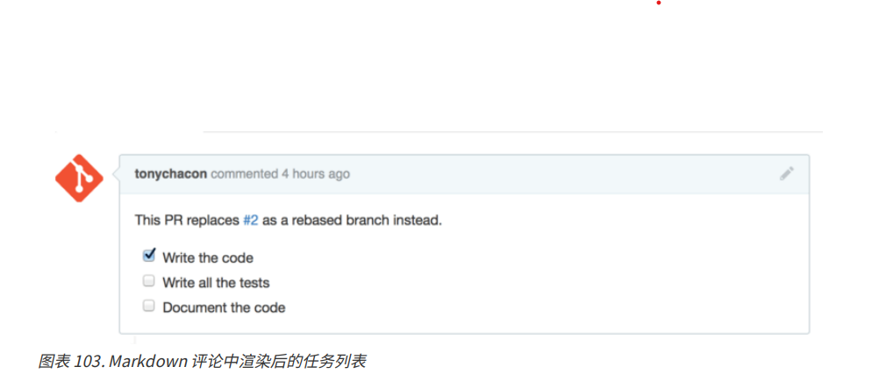

# 对项目做出贡献

## 派生项目

如果想要参与某个项目但是没有权限，就可以对该项目进行“派生（fork）”。
派生一个项目后，Github 就会在个人的空间内部中，创建一个完全属于我们自己的项目副本，且对其具有推送权限。

通过这种方式，项目的管理者不再需要忙着把用户添加到贡献者列表并给予他们推送权限。 人们可以派生这个
项目，将修改推送到派生出的项目副本中，并通过创建拉取请求（Pull Request，简称 PR）来让他们的改动进
入源版本库。

通过点击项目右上角的 Fork 按钮来派生这个项目

## Github 流程

Fork 流程如下
1. 派生一个项目
2. 从 master 分支创建一个新分支
3. 提交一些修改来改进项目
4. 将这个分支推送到 GitHub 上
5. 创建一个拉取请求
6. 讨论，根据实际情况继续修改
7. 项目的拥有者合并或关闭你的拉取请求
8. 将更新后的 master 分支同步到你的派生中

这基本和 集成管理者工作流 中的一体化管理流程差不多，但是团队可以使用 GitHub 提供的网页工具替代电子
邮件来交流和审查修改。

### 创建拉取请求

1. 将派生出的副本克隆到本地
2. 创建出名称有意义的分支
3. 修改代码
4. 检查改动
5. 将改动提交到分支中
6. 将新分支推送到 GitHub 的副本中

然后再查看 Github 上之前的项目副本，可以看到 Github 提示我们有新的分支，并且有绿色的按钮让我们检查改动，并给源项目创建拉取请求。

点击这个绿色按钮之后，就可以跳转到一个新页面，在新页面上可以为拉取请求填写标题和描述。
同时在这个页面上也可以看到比主分支所领先的提交，以及所有将会被合并的改动与之前代码的对比。

新页面右侧有个“Create pull request” 的按钮之后，这个项目的拥有者将会收到一条包含改动和拉去请求页面的链接的提醒。

### 利用拉取请求
现在，项目的拥有者可以看到提交者的改动，可以合并，拒绝或者评论这笔提交。
假设，项目的拥有者赞同这笔提交，但是想要修改灯熄灭的时间比点亮的时间长一点。

在 Github 中，所有操作都可以在网页上完成。项目的拥有者可以审查修改，只需要点击某一行，就可以对其发表评论了。

当维护者发表评论之后，提交拉取请求的人，已经所有正在关注这个版本库的用户都会收到通知。一般，这种通知可以通过邮件方式开启。

如果你使用的是电子邮件进行交流，你需要再次对代码进行修改并重新提交至邮件列表， 这些修改会自动更新到拉取请求上。在最终的拉取请求 中，你也可以在更新后的拉取请求中看到已折叠的旧代码评论， 因为它是在修改后的行上添加的评论。

对现有的拉取请求添加提交并不会触发提醒，因此 Tony 在推送了他的修正后， 还需要通过评论告知项目拥有者他完成了修改请求。

如果你点开拉取请求的“Files Changed”（更改的文件）选项卡，你将会看到“整理过的”差异表 —— 也就是这个分支被合并到主分支之后将会产生的所有改动， 其实就是 git diff master…<分支名> 命令的执行结果。

你还会注意到，GitHub 会检查你的拉取请求是否能直接合并，如果可以，将会提供一个按钮来进行合并操作。这个按钮只在你对版本库有写入权限并且可以进行简洁合并时才会显示。 你点击后 GitHub 将做出一个“非快进式”（non-fast-forward）合并， 即使这个合并 能够 快进式（fast-forward）合并，GitHub 依然会创建一个合并提交。

如果你需要，你还可以将分支拉取并在本地合并。 如果你将这个分支合并到 master 分支中并推送到GitHub，这个拉取请求会被自动关闭。

## 拉取请求的进阶用法

### 将拉取请求制作成补丁

许多项目并不认为拉取请求可以作为补丁， 就和通过邮件列表工作的的项目对补丁贡献的看法一样。 大多数的 GitHub 项目将拉取请求的分支当作对改动的交流方式，并将变更集合起来统一进行合并。

贡献者没有变基他的提交再提交一个新的拉取请求，而是直接增加了新的提交并推送到已有的分支中。点击网页上的“Merge”（合并）按钮后，会建立一个合并提交并指向这个拉取请求

### 与上游保持同步
如果你的拉取请求由于过时或其他原因不能干净地合并，你需要进行修复才能让维护者对其进行合并。 GitHub 会对每个提交进行测试，让你知道你的拉取请求能否简洁的合并。

如果不能自动合并，我们就需要修复分支让这个提示变成绿色，这样维护者就不需要再做额外的工作。
我们有两种方法来解决这个问题。可以把分支变基到目标分支中去 （通常是你派生出的版本库中的 master分支），或者可以合并目标分支到我们的分支中去。

GitHub 上的大多数的开发者会使用后一种方法，基于我们在上一节提到的理由：
我们最看重的是历史记录和最后的合并，变基除了给你带来看上去简洁的历史记录， 只会让你的工作变得更加困难且更容易犯错。

如果想要合并目标分支来让我们的拉取请求变得可合并，需要将源版本库添加为一个新的远端，并从远端抓取内容，合并主分支的内容到你的分支中去，修复所有的问题并最终重新推送回提交拉取请求使用的分支。

在当前这个例子中，使用“tonychacon”用户来进行示范。
源作者提交了一个改动，使得拉取请求和它产生了冲突，看一下解决该问题的步骤。

```
git remote add upstream https://github.com/schacon/blink
git fetch upstream
git merge upstream/master
vim blink.ino
git add blink.ino
git commit
git push origin slow-blink
```

1. 从原版本库中添加一个远端，并命名为 upstream
2. 从远端抓取最新的内容
3. 将该仓库的主分支的内容合并到本地分支
4. 修复产生的内容
5. 再推送回同一个分支

完成以上步骤后，拉取请求将会自动更新并检查是否能干净的合并。

如果你一定想对分支做变基并进行清理，你可以这么做，但是强烈建议你不要强行地提交到已经提交了拉取请求的分支。将变基后的分支推送到 GitHub 上的一个新分支中，并且创建一个全新的拉取请求引用旧的拉取请求，然后关闭旧的拉取请求。


### 参考

你的下个问题可能是“我该如何引用旧的拉取请求？”。 有许多方法可以让你在 GitHub 上的几乎任何地方引用其他东西。

先从如何对拉取请求或议题（Issue）进行相互引用开始。所有的拉取请求和议题在项目中都会有一个独一无二的编号。 举个例子，你无法同时拥有 3 号拉取请求和 3 号议题。

如果你想要引用任何一个拉取请求或议题， 你只需要在提交或描述中输入 #<编号> 即可。 你也可以指定引用其他版本库的议题或拉取请求，如果你想要引用其他人对该版本库的“Fork”中的议题或拉取请求， 输入 用户名#<编号> ，如果在不同的版本库中，输入 用户名/版本库名#<编号> 。

我们来看一个例子。假设我们对上个例子中的分支进行了变基，并为此创建一个新的拉取请求， 现在我们希望能在新的拉取请求中引用旧的拉取请求。 我们同时希望引用一个派生出的项目中的议题和一个完全不同的项目中的议题。

如果 Tony 回去关闭了源拉取请求，我们可以看到一个被引用的提示， GitHub 会自动的反向追踪事件并显示在拉取请求的时间轴上。 这意味着任何查看这个拉取请求的人可以轻松地访问新的拉取请求。

除了议题编号外，你还可以通过使用提交的 SHA-1 来引用提交。 你必须完整的写出 40 位长的 SHA-1，GitHub 会在评论中自动地产生指向这个提交的链接。 同样的，你可以像引用议题一样对派生的项目中的提交或者其他项目中的提交进行引用。

## Github 风格的 Markdown

### Github 风格的 Markdown

#### 任务列表

第一个 GitHub 专属的 Markdown 功能，特别是用在拉取请求中，就是任务列表。 一个任务列表可以展示出一系列你想要完成的事情，并带有复选框。 把它们放在议题或拉取请求中时，通常可以展示你想要完成的事情。
你可以这样创建一个任务列表：
```
- [X] 编写代码
- [ ] 编写所有测试程序
- [ ] 为代码编写文档
```

如果我们将这个列表加入拉取请求或议题的描述中，它将会被渲染成下图所示。



在拉取请求中，任务列表经常被用来在合并之前展示这个分支将要完成的事情。 最酷的地方就是，你只需要点击复选框，就能更新评论 —— 你不需要直接修改 Markdown。

不仅如此，GitHub 还会将你在议题和拉取请求中的任务列表整理起来集中展示。 举个例子，如果你在一个拉取请求中有任务清单，你将会在所有拉取请求的总览页面上看到它的进度。 这使得人们可以把一个拉取请求分解成不同的小任务，同时便于其他人了解分支的进度。
当你在实现一个任务的早期就提交拉取请求，并使用任务清单追踪你的进度，这个功能会十分的有用。

### 代码片段

### 引用

### 表情符号

: 开头，自动完成器会帮助你找到你需要的表情
你也可以在评论的任何地方使用 :<表情名称>: 来添加表情符号。

### 图片

从技术层面来说，这并不是 GitHub 风格 Markdown 的功能，但是也很有用。 如果不想使用 Markdown 语法来插入图片，GitHub 允许你通过拖拽图片到文本区来插入图片。

## 让你的 GitHub 公共仓库保持更新

当你派生了一个 GitHub 仓库之后，你的仓库（即你的“派生”）会独立于原仓库而独立。 特别地，当原仓库有新的提交时，GitHub 会通知你：

但你的 GitHub 仓库不会被 GitHub 自动更新，这件事必须由你自己来做。还好，这事儿很简单。

第一种方法无需配置。例如，若你从 https://github.com/progit/progit2.git 派生了项目， 你可以像
这样更新你的 master 分支：
```
git checkout master
git pull https://github.com/progit/progit2.git
git push origin master
```
1. 如果在另一个分支上，就切换到 master
2. 从 https://github.com/progit/progit2.git 抓取更改后合并到 master
3. 将 master 分支推送到 origin

可以设置自动完成他：
```
git remote add progit https://github.com/progit/progit2.git
git branch --set-upstream-to=progit/master master
git config --local remote.pushDefault origin
```

1. 添加源仓库并取一个名字，这里叫它 progit
2. 将 master 分支设置为从 progit 远端抓取
3. 将默认推送仓库设置为 origin

这种方法可能很有用，但也不是没有缺点。如果你向 master 提交，再从 progit 中拉取，然后推送到origin，Git 会很乐意安静地为您完成这项工作，但不会警告你——所有这些操作在以上设置下都是有效的。
所以你必须注意永远不要直接提交到 master，因为该分支实际上属于上游仓库。
