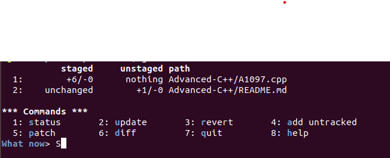

# 交互式暂存

本节中的几个交互式 Git 命令可以帮助你将文件的特定部分组合成提交。 当你在修改了大量文件后，希望这些改动能拆分为若干提交而不是混杂在一起成为一个提交时，这几个工具会非常有用。 通过这种方式，可以确保提交是逻辑上独立的变更集，同时也会使其他开发者在与你工作时很容易地审核。 如果运行 git add 时使用 -i 或者 --interactive 选项，Git 将会进入一个交互式终端模式。

两部分，其中第一部分内容与 git status 是相同的信息，但是更简明扼要一些。 它将暂存的修改列在左侧，未暂存的修改列在右侧

在这块区域后是“Commands”命令区域。 在这里你可以做一些工作，包括暂存文件、取消暂存文件、暂存文件的一部分、添加未被追踪的文件、显示暂存内容的区别。

## 暂存和取消暂存文件
在 What now> 提示符号后键入 u，终端会输入可以暂存的文件列表并问你想要暂存哪个文件，输入文件前的数字序号，就表示选中该文件，接着在 Update>> 后直接 enter，Git 就会暂存之间选择的文件
如果想要多选文件，可以在 Update>> 后继续输入数字

取消暂存文件，是在 What now>> 后输入 r，然后根据终端给出的可以取消暂存文件的列表中，选择想要取消暂存文件的前方数字序号，最后确定时直接 enter 即可。

## 暂存补丁

Git 还可以暂存文件的特定部分。

在 What now>> 中选择 p
然后在 Patch update>> 提示符号选择暂存文件的序号，然后再 enter，接着 Git 会将该文件的所有修改部分一一列举出来,然后根据 y/n 来确定现实的修改区域是否需要暂存。

选择好暂存的文件和文件内部部分内容后，可以使用 git commit 提交暂存的内部文件。

当然，上述中交互式添加模式中的部分文件暂存也可以通过命令 git add -p 来启动

更进一步，可以使用 git reset --patch 补丁模式来部分重置文件，通过 git checkout --patch 来部分检出文件和 git stash save --patch 命令来部分暂存文件。