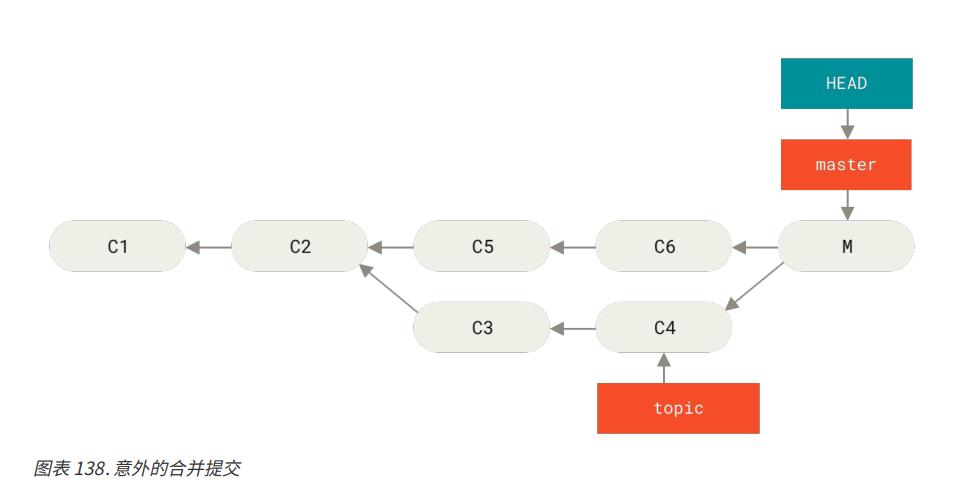
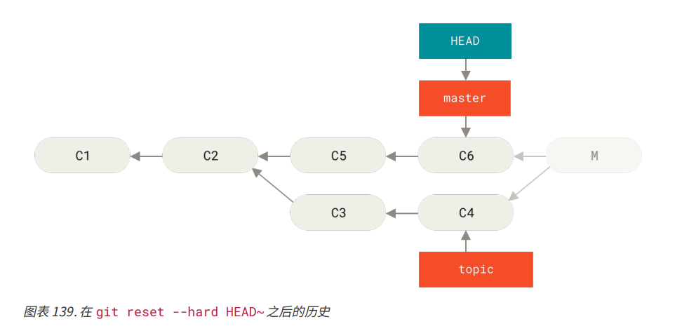
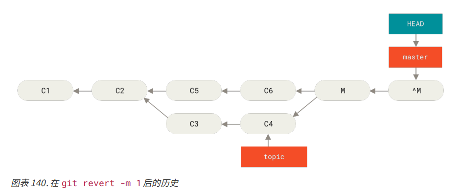
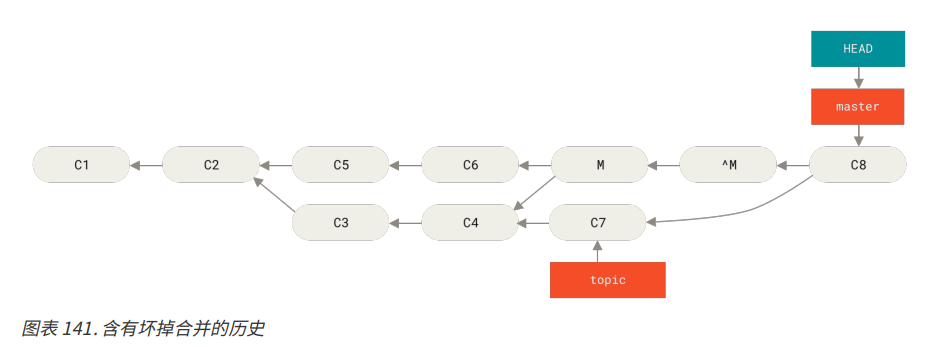

# 高级合并

在 Git 中合并是相当容易的。 因为 Git 使多次合并另一个分支变得很容易，这意味着你可以有一个始终保持最新的长期分支， 经常解决小的冲突，比在一系列提交后解决一个巨大的冲突要好。

然而，有时也会有棘手的冲突。 不像其他的版本控制系统，Git 并不会尝试过于聪明的合并冲突解决方案。 Git 的哲学是聪明地决定无歧义的合并方案，但是如果有冲突，它不会尝试智能地自动解决它。 因此，如果很久之后才合并两个分叉的分支，你可能会撞上一些问题。

## 合并冲突

Git 提供了几个工具来处理更复杂的冲突。

首先，在做一次可能有冲突的合并前尽可能保证工作目录是干净的。 如果你有正在做的工作，要么提交到一个临时分支要么储藏它。 这使你可以撤消在这里尝试做的 任何事情 。 如果在你尝试一次合并时工作目录中有未保存的改动，下面的这些技巧可能会使你丢失那些工作。

让我们通过一个非常简单的例子来了解一下。 我们有一个超级简单的打印 'hello world' 的 Ruby 文件

```
#! /usr/bin/env ruby
def hello
  puts 'hello world'
end
hello()
```

在我们的仓库中，创建一个名为 whitespace 的新分支并将所有 Unix 换行符修改为 DOS 换行符， 实质上虽然改变了文件的每一行，但改变的都只是空白字符。 然后我们修改行 “hello world” 为 “hello mundo”。

```
git checkout -b whitespace
unix2dos hello.rb
vim hello.rb
git diff -b
git commit -am 'hello mundo change'
```

现在我们切换回我们的 master 分支并为函数增加一些注释。

```
git checkout master
vim hello.rb
git commit -am 'document the function'
```

现在我们尝试合并入我们的 whitespace 分支，因为修改了空白字符，所以合并会出现冲突。
```
git merge whitespace
```

### 中断一次合并

如果不想处理这种情况的冲突，可以使用命令退出合并
`git merge --abort`

git merge --abort 选项会尝试恢复到你运行合并前的状态。 但当运行命令前，在工作目录中有未储藏、未提交的修改时它不能完美处理，除此之外它都工作地很好。

如果出于某些原因你想要重来一次，也可以运行 `git reset --hard HEAD` 回到上一次提交的状态。
请牢记此时任何未提交的工作都会丢失，所以请确认你不需要保留任何改动。

### 忽略空白

在这个特定的例子中，冲突与空白有关。 我们知道这点是因为这个例子很简单，但是在实际的例子中发现这样的冲突也很容易， 因为每一行都被移除而在另一边每一行又被加回来了。 默认情况下，Git 认为所有这些行都改动了，所以它不会合并文件。

默认合并策略可以带有参数，其中的几个正好是关于忽略空白改动的。 如果你看到在一次合并中有大量关于空白的问题，你可以直接中止它并重做一次， 这次使用 `-Xignore-all-space` 或 `-Xignore-space-change` 选项。 第一个选项在比较行时 完全忽略 空白修改，第二个选项将一个空白符与多个连续的空白字符视作等价的。

`git merge -Xignore-space-change whitespace`

因为在本例中，实际上文件修改并没有冲突，一旦我们忽略空白修改，每一行都能被很好地合并。
如果你的团队中的某个人可能不小心重新格式化空格为制表符或者相反的操作，这会是一个救命稻草。

### 手动处理文件再合并

假设 Git 无法处理空白修改因此我们需要手动处理

首先，我们进入到了合并冲突状态。 然后我们想要我的版本的文件，他们的版本的文件（从我们将要合并入的分支）和共同的版本的文件（从分支叉开时的位置）的拷贝。 然后我们想要修复任何一边的文件，并且为这个单独的文件重试一次合并。

获得这三个文件版本实际上相当容易。 Git 在索引中存储了所有这些版本，在 “stages” 下每一个都有一个数字与它们关联。 Stage 1 是它们共同的祖先版本，stage 2 是你的版本，stage 3 来自于 MERGE_HEAD，即你将要合并入的版本（“theirs”）。

过 git show 命令与一个特别的语法，你可以将冲突文件的这些版本释放出一份拷贝。

```
$ git show :1:hello.rb > hello.common.rb
$ git show :2:hello.rb > hello.ours.rb
$ git show :3:hello.rb > hello.theirs.rb
```

如果你想要更专业一点，也可以使用 ls-files -u 底层命令来得到这些文件的 Git blob 对象的实际 SHA-1 值

既然在我们的工作目录中已经有这所有三个阶段的内容，我们可以手工修复它们来修复空白问题，然后使用鲜为人知的 `git merge-file` 命令来重新合并那个文件。

在这时我们已经漂亮地合并了那个文件。 实际上，这比使用 ignore-space-change 选项要更好，因为在合并前真正地修复了空白修改而不是简单地忽略它们。 在使用 ignore-space-change 进行合并操作后，我们最终得到了有几行是 DOS 行尾的文件，从而使提交内容混乱了。

如果你想要在最终提交前看一下我们这边与另一边之间实际的修改， 你可以使用 git diff 来比较将要提交作为合并结果的工作目录与其中任意一个阶段的文件差异。 让我们看看它们。

要在合并前比较结果与在你的分支上的内容，换一句话说，看看合并引入了什么，可以运行 `git diff --ours`

我们可以很容易地看到在我们的分支上发生了什么，在这次合并中我们实际引入到这个文件的改动，是修改了其中一行。

如果我们想要查看合并的结果与他们那边有什么不同，可以运行 `git diff --theirs`。 在本例及后续的例子中，我们会使用 -b 来去除空白，因为我们将它与 Git 中的， 而不是我们清理过的 hello.theirs.rb 文件比较。

`git diff --theirs -b`

最终，你可以通过 `git diff --base` 来查看文件在两边是如何改动的。

在这时我们可以使用 `git clean -f` 命令来清理我们为手动合并而创建但不再有用的额外文件.

### 检出冲突

有时候我们需要手动编辑一边或者两边的冲突，需要更多的上下文关联来解决问题。


如下所示：master 分支有三次单独的提交，mundo 有三次单独的提交
```
$ git log --graph --oneline --decorate --all
* f1270f7 (HEAD, master) update README
* 9af9d3b add a README
* 694971d update phrase to hola world
| * e3eb223 (mundo) add more tests
| * 7cff591 add testing script
| * c3ffff1 changed text to hello mundo
|/
* b7dcc89 initial hello world code
```

如果我们尝试将 mudo 分支合并到 master 分支，我们将会得到一个冲突。

```
$ git merge mundo
Auto-merging hello.rb
CONFLICT (content): Merge conflict in hello.rb
Automatic merge failed; fix conflicts and then commit the result.
```

然后可以打开发生冲突的文件，查看不同分支在该文件中哪些地方发生了冲突

一个很有用的工具是带 --conflict 选项的 git checkout。 这会重新检出文件并替换合并冲突标记。 如果想要重置标记并尝试再次解决它们的话这会很有用。
可以传递给 --conflict 参数 diff3 或 merge（默认选项）。 如果传给它 diff3，Git 会使用一个略微不同版本的冲突标记： 不仅仅只给你 “ours” 和 “theirs” 版本，同时也会有 “base” 版本在中间来给你更多的上下文。

` git checkout --conflict=diff3 hello.rb`

当有二进制文件冲突时这可能会特别有用，因为可以简单地选择一边，或者可以只合并另一个分支的特定文件——可以做一次合并然后在提交前检出一边或另一边的特定文件。

### 合并日志

另一个解决合并冲突有用的工具是 git log。 这可以帮助你得到那些对冲突有影响的上下文。 回顾一点历史来记起为什么两条线上的开发会触碰同一片代码有时会很有用。

为了得到此次合并中包含的每一个分支的所有独立提交的列表， 我们可以使用之前在 <三点 学习的“三点”语法。

```
$ git log --oneline --left-right HEAD...MERGE_HEAD
< f1270f7 update README
< 9af9d3b add a README
< 694971d update phrase to hola world
> e3eb223 add more tests
> 7cff591 add testing script
> c3ffff1 changed text to hello mundo
```

这个漂亮的列表包含 6 个提交和每一个提交所在的不同开发路径。

我们可以通过更加特定的上下文来进一步简化这个列表。 如果我们添加 --merge 选项到 git log 中，它会只显示任何一边接触了合并冲突文件的提交。

```
$ git log --oneline --left-right --merge
< 694971d update phrase to hola world
> c3ffff1 changed text to hello mundo
```

如果你运行命令时用 -p 选项代替，你会得到所有冲突文件的区别。 快速获得你需要帮助理解为什么发生冲突的上下文，以及如何聪明地解决它，这会 非常 有用。

### 组合式差异格式

因为 Git 暂存合并成功的结果，当你在合并冲突状态下运行 git diff 时，只会得到现在还在冲突状态的区别。当需要查看你还需要解决哪些冲突时这很有用。

在合并冲突后直接运行的 git diff 会给你一个相当独特的输出格式。

这种叫作“组合式差异”的格式会在每一行给你两列数据。 第一列为你显示 “ours” 分支与工作目录的文件区别（添加或删除）， 第二列显示 “theirs” 分支与工作目录的拷贝区别。

所以在上面的例子中可以看到 <<<<<<< 与 >>>>>>> 行在工作拷贝中但是并不在合并的任意一边中。 这很有意义，合并工具因为我们的上下文被困住了，它期望我们去移除它们。

如果我们解决冲突再次运行 git diff，我们将会看到同样的事情，但是它有一点帮助。

这里显示出 “hola world” 在我们这边但不在工作拷贝中，那个 “hello mundo” 在他们那边但不在工作拷贝中， 最终 “hola mundo” 不在任何一边但是现在在工作拷贝中。在提交解决方案前这对审核很有用。

也可以在合并后通过 git log 来获取相同信息，查看冲突是如何解决的。 如果你对一个合并提交运行 git show 命令 Git 将会输出这种格式， 或者你也可以在 git log -p（默认情况下该命令只会展示还没有合并的补丁）命令之后加上 --cc 选项。

## 撤销合并

虽然你已经知道如何创建一个合并提交，但有时出错是在所难免的。 使用 Git 最棒的一件事情是犯错是可以的，因为有可能（大多数情况下都很容易）修复它们。

合并提交并无不同。 假设现在在一个主题分支上工作，不小心将其合并到 master 中，现在提交历史看起来是这样：



有两种方法来解决这个问题，这取决于你想要的结果是什么。

### 修复引用

如果这个不想要的合并提交只存在于你的本地仓库中，最简单且最好的解决方案是移动分支到你想要它指向的地方。 大多数情况下，如果你在错误的 git merge 后运行 git reset --hard HEAD~，这会重置分支指向所以它们看起来像这样：



我们之前在 重置揭密 已经介绍了 reset，所以现在指出这里发生了什么并不是很困难。 让我们快速复习下：reset --hard 通常会经历三步：

1. 移动 HEAD 指向的分支。 在本例中，我们想要移动 master 到合并提交（C6）之前所在的位置。
2. 使索引看起来像 HEAD。
3. 使工作目录看起来像索引。

该方法有个缺点：
如果其他人已经有你将要重写的提交，你应当避免使用 reset。 如果有任何其他提交在合并之后创建了，那么这个方法也会无效；移动引用实际上会丢失那些改动。

### 还原提交

如果移动分支指针并不适合你，Git 给你一个生成一个新提交的选项，提交将会撤消一个已存在提交的所有修改。 Git 称这个操作为“还原”，在这个特定的场景下，你可以像这样调用它：

`git revert -m 1 HEAD`

-m 1 标记指出 “mainline” 需要被保留下来的父结点。 当你引入一个合并到 HEAD（git merge topic），新提交有两个父结点：第一个是 HEAD（C6），第二个是将要合并入分支的最新提交（C4）。 在本例中，我们想要撤消所有由父结点 #2（C4）合并引入的修改，同时保留从父结点 #1（C6）开始的所有内容。

有还原提交的历史看起来像这样：



新的提交 ^M 与 C6 有完全一样的内容，所以从这儿开始就像合并从未发生过，除了“现在还没合并”的提交依然在 HEAD 的历史中。 如果你尝试再次合并 topic 到 master Git 会感到困惑：

`git merge topic`

topic 中并没有东西不能从 master 中追踪到达。 更糟的是，如果你在 topic 中增加工作然后再次合并，Git 只会引入被还原的合并 之后 的修改。



解决这个最好的方式是撤消还原原始的合并，因为现在你想要引入被还原出去的修改，然后 创建一个新的合并提交：

`git revert ^M`


在本例中，M 与 ^M 抵消了。 ^^M 事实上合并入了 C3 与 C4 的修改，C8 合并了 C7 的修改，所以现在 topic 已经完全被合并了。

## 其他类西的合并

到目前为止我们介绍的都是通过一个叫作 “recursive” 的合并策略来正常处理的两个分支的正常合并。 然而还有其他方式来合并两个分支到一起。 让我们来快速介绍其中的几个。

### 我们的或他们的偏好
首先，有另一种我们可以通过 “recursive” 合并模式做的有用工作。

我们之前已经看到传递给 -X 的 ignoreall-space 与 ignore-space-change 选项， 但是我们也可以告诉 Git 当它看见一个冲突时直接选择一边。

默认情况下，当 Git 看到两个分支合并中的冲突时，它会将合并冲突标记添加到你的代码中并标记文件为冲突状态来让你解决。 如果你希望 Git 简单地选择特定的一边并忽略另外一边而不是让你手动解决冲突，你可以传递给 merge 命令一个-Xours 或 -Xtheirs 参数。

如果 Git 看到这个，它并不会增加冲突标记。 任何可以合并的区别，它会直接合并。 任何有冲突的区别，它会简单地选择你全局指定的一边，包括二进制文件。

如果我们回到之前我们使用的 “hello world” 例子中，我们可以看到合并入我们的分支时引发了冲突。

这个选项也可以传递给我们之前看到的 git merge-file 命令， 通过运行类似 `git merge-file --ours` 的命令来合并单个文件。

如果想要做类似的事情但是甚至并不想让 Git 尝试合并另外一边的修改， 有一个更严格的选项，它是 “ours” 合并 策略。 这与 “ours” recursive 合并 选项 不同。

这本质上会做一次假的合并。 它会记录一个以两边分支作为父结点的新合并提交，但是它甚至根本不关注你正合并入的分支。 它只会简单地把当前分支的代码当作合并结果记录下来。

当再次合并时从本质上欺骗 Git 认为那个分支已经合并过经常是很有用的。 例如，假设你有一个分叉的release 分支并且在上面做了一些你想要在未来某个时候合并回 master 的工作。 与此同时 master 分支上的某些 bugfix 需要向后移植回 release 分支。 你可以合并 bugfix 分支进入 release 分支同时也 merge -s ours 合并进入你的 master 分支 （即使那个修复已经在那儿了）这样当你之后再次合并 release 分支时，就不会有来自 bugfix 的冲突。

### 子树合并

子树合并的思想是你有两个项目，并且其中一个映射到另一个项目的一个子目录，或者反过来也行。 当你执行一个子树合并时，Git 通常可以自动计算出其中一个是另外一个的子树从而实现正确的合并。

我们来看一个例子如何将一个项目加入到一个已存在的项目中，然后将第二个项目的代码合并到第一个项目的子目录中。

首先，我们将 Rack 应用添加到你的项目里。 我们把 Rack 项目作为一个远程的引用添加到我们的项目里，然后检出到它自己的分支。

```
$ git remote add rack_remote https://github.com/rack/rack
$ git fetch rack_remote --no-tags
warning: no common commits
remote: Counting objects: 3184, done.
remote: Compressing objects: 100% (1465/1465), done.
remote: Total 3184 (delta 1952), reused 2770 (delta 1675)
Receiving objects: 100% (3184/3184), 677.42 KiB | 4 KiB/s, done.
Resolving deltas: 100% (1952/1952), done.
From https://github.com/rack/rack
 * [new branch] build -> rack_remote/build
 * [new branch] master -> rack_remote/master
 * [new branch] rack-0.4 -> rack_remote/rack-0.4
 * [new branch] rack-0.9 -> rack_remote/rack-0.9
$ git checkout -b rack_branch rack_remote/master
Branch rack_branch set up to track remote branch
refs/remotes/rack_remote/master.
Switched to a new branch "rack_branch"
```

现在在我们的 rack_branch 分支里就有 Rack 项目的根目录，而我们的项目则在 master 分支里。 如果你从一个分支切换到另一个分支，你可以看到它们的项目根目录是不同的：

```
$ ls
AUTHORS KNOWN-ISSUES Rakefile contrib lib
COPYING README bin example test
$ git checkout master
Switched to branch "master"
$ ls
README
```

这个是一个比较奇怪的概念。 并不是仓库中的所有分支都是必须属于同一个项目的分支.
这并不常见，因为没啥用，但是却是在不同分支里包含两条完全不同提交历史的最简单的方法。

在这个例子中，我们希望将 Rack 项目拉到 master 项目中作为一个子目录。 我们可以在 Git 中执行 git read-tree 来实现。 你可以在 Git 内部原理 中查看更多 read-tree 的相关信息，现在你只需要知道它会读取一个分支的根目录树到当前的暂存区和工作目录里。 先切回你的 master 分支，将 rack_back 分支拉取到我们项目的 master 分支中的 rack 子目录。

`git read-tree --prefix=rack/ -u rack_branch`

当我们提交时，那个子目录中拥有所有 Rack 项目的文件 —— 就像我们直接从压缩包里复制出来的一样。 有趣的是你可以很容易地将一个分支的变更合并到另一个分支里。 所以，当 Rack 项目有更新时，我们可以切换到那个分支来拉取上游的变更。

```
$ git checkout rack_branch
$ git pull
```

接着，我们可以将这些变更合并回我们的 master 分支。 使用 --squash 选项和使用 -Xsubtree 选项（它采用递归合并策略）， 都可以用来可以拉取变更并且预填充提交信息。 （递归策略在这里是默认的，提到它是为了让读者有个清晰的概念。）

```
$ git checkout master
$ git merge --squash -s recursive -Xsubtree=rack rack_branch
Squash commit -- not updating HEAD
Automatic merge went well; stopped before committing as requested
```

Rack 项目中所有的改动都被合并了，等待被提交到本地。 你也可以用相反的方法——在 master 分支上的rack 子目录中做改动然后将它们合并入你的 rack_branch 分支中，之后你可能将其提交给项目维护着或者将它们推送到上游。

这给我们提供了一种类似子模块工作流的工作方式，但是它并不需要用到子模块 （有关子模块的内容我们会在子模块 中介绍）。 我们可以在自己的仓库中保持一些和其他项目相关的分支，偶尔使用子树合并将它们合并到我们的项目中。 某些时候这种方式很有用，例如当所有的代码都提交到一个地方的时候。 然而，它同时也有缺点，它更加复杂且更容易让人犯错，例如重复合并改动或者不小心将分支提交到一个无关的仓库上去。

另外一个有点奇怪的地方是，当你想查看 rack 子目录和 rack_branch 分支的差异—— 来确定你是否需要合并它们——你不能使用普通的 diff 命令。 取而代之的是，你必须使用 git diff-tree 来和你的目标分支做比较：

`git diff-tree -p rack_branch`

或者，将你的 rack 子目录和最近一次从服务器上抓取的 master 分支进行比较，你可以运行：

`git diff-tree -p rack_remote/master`


